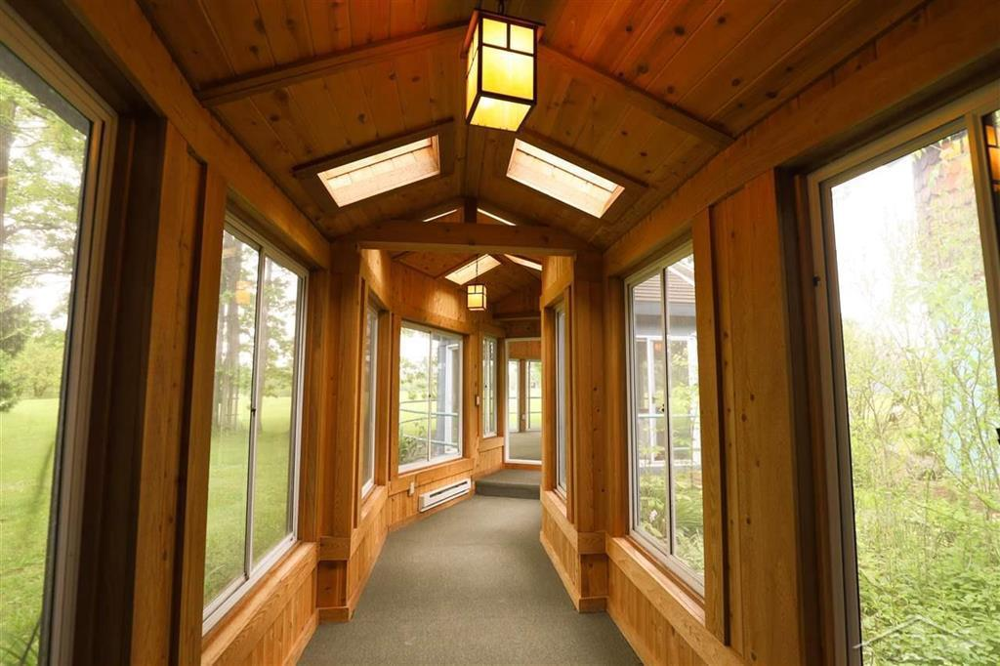

<h2>llama-3.2-vision</h2>

<i>Llama-3.2-Vision-11B is a really good model that probably gets the visual details right but doesn't understand literary or media references, and often fails to accurately represent the physical arrangement of objects and the implied relationships between the objects.</i>

The meme is a picture of a long, narrow hallway with many windows on one side and a wall of doors on the other. The text &quot;I&#x27;m not arguing, I&#x27;m just explaining why I&#x27;m right&quot; is written on a sign on the wall. The image is meant to be humorous because it&#x27;s a literal representation of someone being stubborn and refusing to listen to others.

<h2>first-seen</h2>

<i>Because Git doesn't preserve file modification times, this metadata file contains the file's modification time when it was added to the library.</i>

2023-05-22T01:29:19+00:00

<h2>tesseract</h2>

<i>Tesseract is often terrible and just gives a lot of nonsense characters, but it used to be the state of the art, and usually it is better at correctly representing text than llama-3.2-vision-11b.</i>

(i 7 4 Ky j ae *~ ! ‘a | _o ime | ¢ | il | || Bae | - j a a

