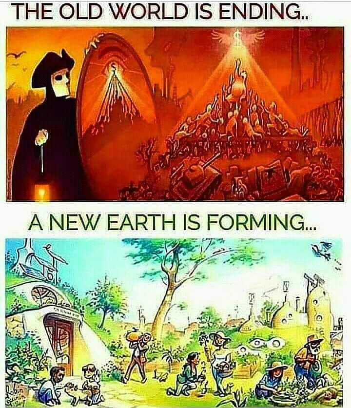

<h2>llama-3.2-vision</h2>

This meme is a humorous comparison between two contrasting images. The top image depicts a medieval-style scene with a monk, a castle, and a crowd of people, with the text &quot;THE OLD WORLD IS ENDING...&quot; above it. The bottom image shows a post-apocalyptic scene with a group of people living in a new, sustainable environment, with the text &quot;A NEW EARTH IS FORMING...&quot; above it. The meme is meant to be humorous and satirical, suggesting that the old world is ending and a new, better world is being formed.

<h2>first-seen</h2>

2023-05-10T21:03:35+00:00

<h2>tesseract</h2>

THE OLD WORLD IS ENDING.. = a S g | [ | Ck Me ee | A ON PR. itl x: Nae ORAM si | \ ee a peg ae gai PR ewe: JAAS Oe eee eal A NEW EARTH IS FORMING... ) we oe ee 24 = ON oe tS Fe soe Ne fF Ba) TS pete fo yh, ease: WEL. GL FRO Ao P eats . Re Waele: pagar

