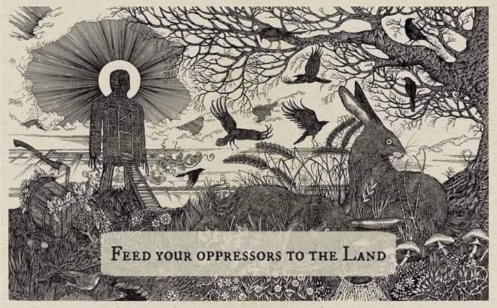

<h2>llama-3.2-vision</h2>

The meme is a darkly humorous image of a person being devoured by a forest of trees and animals, with a full moon in the background. The text &quot;Feed your oppressors to the land&quot; is written in a bold, gothic font at the bottom of the image. The overall tone is one of dark, satirical humor, implying that one&#x27;s enemies should be made to suffer in a way that is both literal and metaphorical.

<h2>first-seen</h2>

2023-05-10T21:03:35+00:00

<h2>tesseract</h2>

Sea FABRA ARV NES. PB BIC AER NY YS eg SSS eee Se WW ESS Y  =a Se TIT a Ne  __—eaieeeae sy, aM Sia a f Mh ec iB MS eS! at SN NG a) — ee  “oP Sp SS eo NA oA ae re Sees S| ee seal Yak Hi Ce  an A a f Uae eae  US ip ite aN ANOS eet ee ow DP ert eas FEep your oppressors To THE Lanp 9aynine 7 = PS &lt;M OEALD.  NG reef Sk: = TIO si eS NANI ND (RD REP IS ee DUT tse a NERO IN

