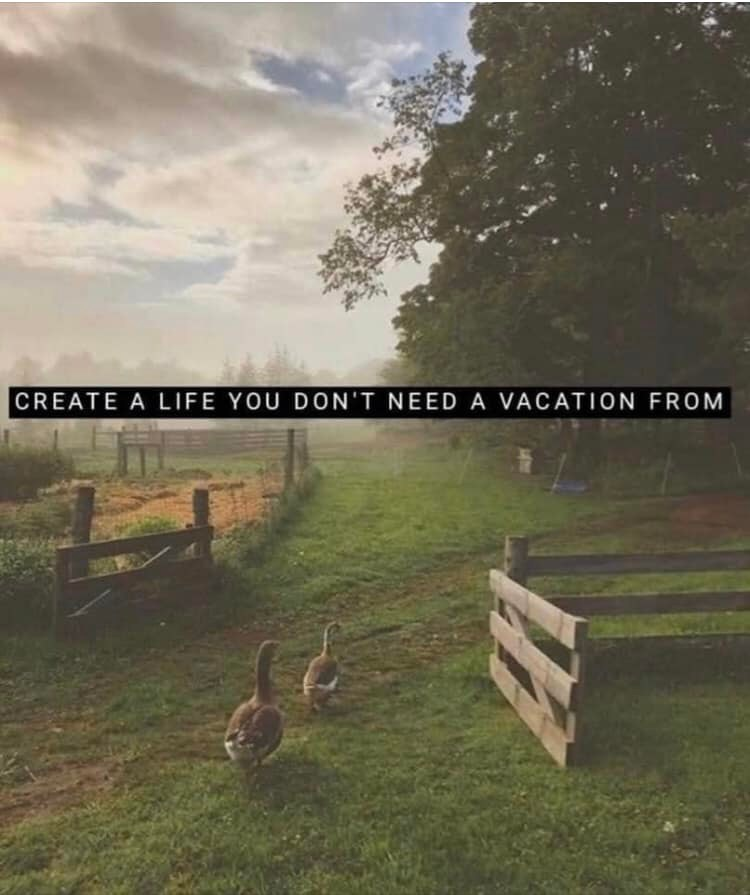

<h2>llama-3.2-vision</h2>

<i>Llama-3.2-Vision-11B is a really good model that probably gets the visual details right but doesn't understand literary or media references, and often fails to accurately represent the physical arrangement of objects and the implied relationships between the objects.</i>

This meme is a humorous image of a rural landscape with a fence, trees, and a sign that says &quot;Create a life you don&#x27;t need a vacation from.&quot; The image is meant to be ironic, suggesting that a person should create a life that is so fulfilling and enjoyable that they don&#x27;t need to take a break from it. The text is a play on the popular phrase &quot;create a life you don&#x27;t need a vacation from,&quot; which is often used to encourage people to live their lives in a way that is not just a .

<h2>first-seen</h2>

<i>Because Git doesn't preserve file modification times, this metadata file contains the file's modification time when it was added to the library.</i>

2023-05-10T21:03:35+00:00

<h2>tesseract</h2>

<i>Tesseract is often terrible and just gives a lot of nonsense characters, but it used to be the state of the art, and usually it is better at correctly representing text than llama-3.2-vision-11b.</i>

- : a? ie iM e 3. , es = ot; 5 as p a oe ria Ps 3 eke eee oS ee oan TPM, CREATE A LIFE YOU DON&#x27;T NEED A VACATION FROM of: of ieee — — i pa NS ie y

