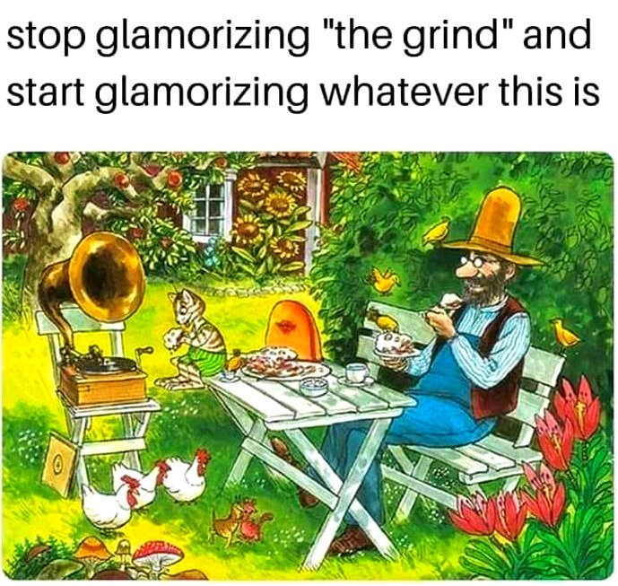

<h2>llama-3.2-vision</h2>

This meme is a humorous image with a caption that pokes fun at the idea of &quot;giving something a makeover&quot; or &quot;giving something a new look&quot; by using an old, familiar phrase in a new and unexpected way. The image shows a cartoon man sitting at a table in a garden, surrounded by animals, eating a meal, while a record player plays music in the background. The text above the image reads: &quot;stop glamorizing &#x27;the grind&#x27; and start glamorizing whatever this is&quot;.

<h2>first-seen</h2>

2023-05-10T21:03:35+00:00

<h2>tesseract</h2>

stop glamorizing &quot;the grind&quot; and  start glamorizing whatever this is SS ede pemen pet ie  ee ed  en a cu oe Fo ‘heb Fy Als a eA ey |

