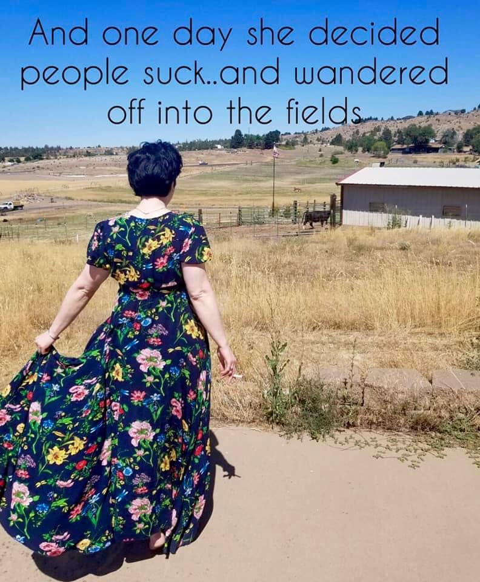

<h2>llama-3.2-vision</h2>

<i>Llama-3.2-Vision-11B is a really good model that probably gets the visual details right but doesn't understand literary or media references, and often fails to accurately represent the physical arrangement of objects and the implied relationships between the objects.</i>

This meme features a woman walking away from a rural setting, with a humorous quote about her decision to leave her life behind. The text reads: &quot;And one day she decided people suck...and wandered off into the fields.&quot; The image is meant to be humorous and relatable, poking fun at the idea of wanting to escape from the stresses of life.

<h2>first-seen</h2>

<i>Because Git doesn't preserve file modification times, this metadata file contains the file's modification time when it was added to the library.</i>

2023-05-10T21:03:35+00:00

<h2>tesseract</h2>

<i>Tesseract is often terrible and just gives a lot of nonsense characters, but it used to be the state of the art, and usually it is better at correctly representing text than llama-3.2-vision-11b.</i>

And one day she decided ozople suck..and wandered Off into the fic sen camecere = Ss acces See =f oe rss ee 7 Sen : EES bs i hil Nn JOE ASN). UiSee tbat] oa eS She oe 8 Re ae Oe ey, ae VE OO a ee Sc, BAe | bee POs, ee Sak) Sh RRS: aes tee Oi tet s, eds 0) Oem sis ey ec fT

