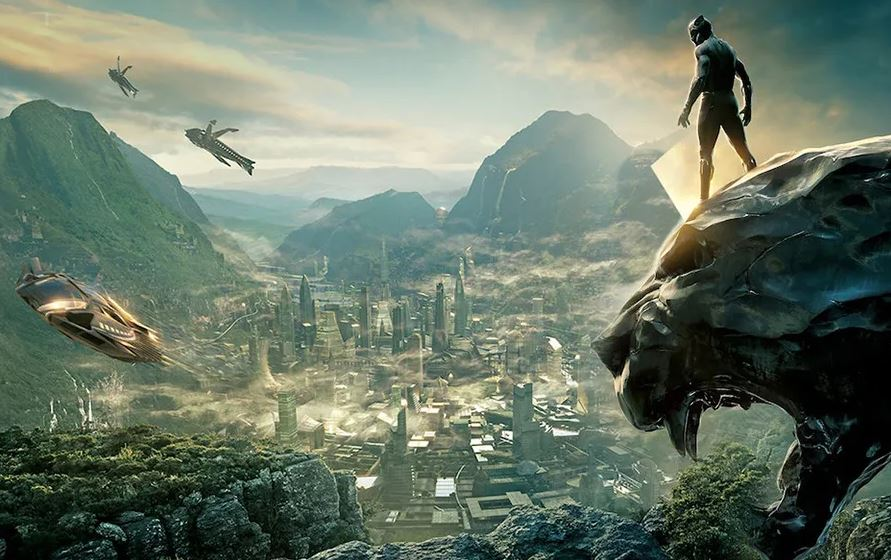

<h2>llama-3.2-vision</h2>

This meme is an image of the Black Panther movie poster with the city of Wakanda in the background. The text &quot;I can see for miles&quot; is written in a bold, comic book-style font, referencing the song of the same name by The     . The image is likely a joke about the city&#x27;s impressive views, with the song&#x27;s lyrics implying that the city&#x27;s location allows for a wide   .

<h2>first-seen</h2>

2023-08-15T00:57:50+00:00

<h2>tesseract</h2>

a ~ Li Est EE fe wi ae Ps a Ae : aes J aE SN cst: af at gia eens hs &lt;  ~aSss vain Ve ——— Sa ae ee &#125; a ee a gSo0- re eel = Reo! Ae ie =&gt; Spee SS Sie aie, el a4 Aaa are a | &#123;= , Nei igs — eg a Ee ie 4 Pe Sere a5 ies ic | Eee ee oe a Bs a ‘ . = ee ox ge | 4 7

