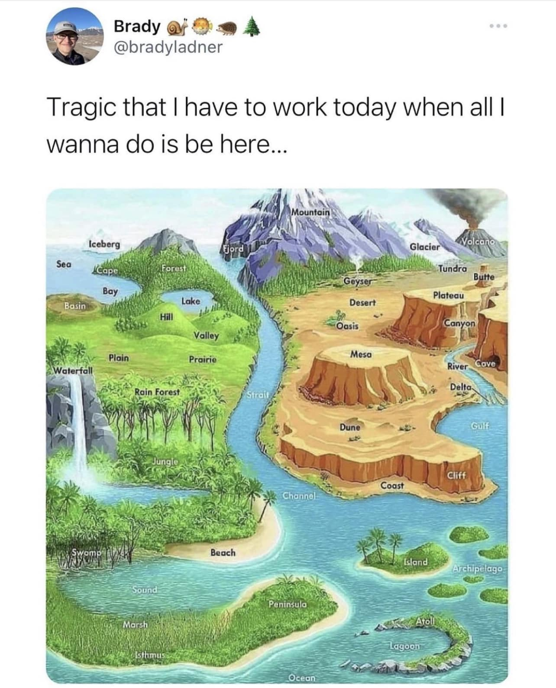

<h2>llama-3.2-vision</h2>

<i>Llama-3.2-Vision-11B is a really good model that probably gets the visual details right but doesn't understand literary or media references, and often fails to accurately represent the physical arrangement of objects and the implied relationships between the objects.</i>

This meme is a humorous take on the common phrase &quot;I have to work today when I&#x27;d rather be doing something else.&quot; The image is a fantastical, cartoon-like map of a world that includes a variety of environments, such as mountains, forests, and oceans. The text at the top reads, &quot;Tragic that I have to work today when all I want to do is be in one of these places.&quot;

<h2>first-seen</h2>

<i>Because Git doesn't preserve file modification times, this metadata file contains the file's modification time when it was added to the library.</i>

2023-05-10T21:03:35+00:00

<h2>tesseract</h2>

<i>Tesseract is often terrible and just gives a lot of nonsense characters, but it used to be the state of the art, and usually it is better at correctly representing text than llama-3.2-vision-11b.</i>

-_ ” é Brady @f @ = A @bradyladner Tragic that | have to work today when all | wanna do is be here... ; \ Ht dX nw oy m4 ni oN {i &amp; i. FAB &amp; | ~ . Icebergs | Miibace % ia fa RS Nh, Glacier GN Seo yi PENI, ot ie y ye i k Tondo ge Hill % ay Cony on oe ow fal : ‘ j A . : &lt;S &quot; ee Be en tar “eae ZN Rea WN? | of Fs * ungle v5 &lt; di os ” : % : SN oe Cliff i - : gage = .7 Channela =~ -AeeOT nist n ‘ies 4 uh AWE SS Beach ee ill 4 SS eS ee Se Bee» Se need eS gis = ‘ee. EST Ee&quot; 2a

