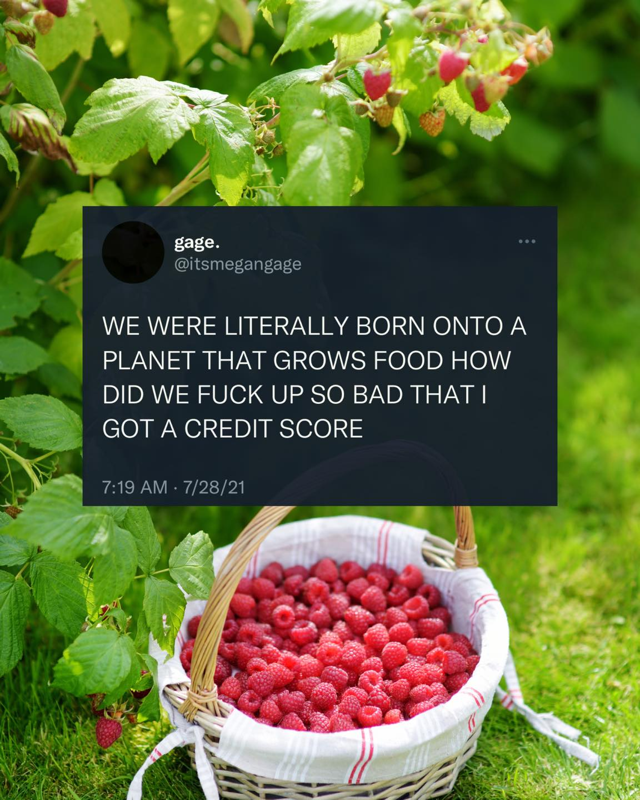

<h2>llama-3.2-vision</h2>

<i>Llama-3.2-Vision-11B is a really good model that probably gets the visual details right but doesn't understand literary or media references, and often fails to accurately represent the physical arrangement of objects and the implied relationships between the objects.</i>

The meme is a humorous tweet that expresses frustration with the idea that humans were born on a planet that has a perfect environment for growing food, yet they still have to deal with financial issues and have a bad credit score. The text reads: &quot;We were born on a planet that can grow food in every direction, and we&#x27;re still f**king up so bad that I got a credit score.&quot;

<h2>first-seen</h2>

<i>Because Git doesn't preserve file modification times, this metadata file contains the file's modification time when it was added to the library.</i>

2023-05-10T21:03:35+00:00

<h2>tesseract</h2>

<i>Tesseract is often terrible and just gives a lot of nonsense characters, but it used to be the state of the art, and usually it is better at correctly representing text than llama-3.2-vision-11b.</i>

woe VN Fed ee ~ y Le oA = 2 goat Loe Dar ~~ Se —, ar Be) gage. erry @itsmegangage WE WERE LITERALLY BORN ONTO A PLANET THAT GROWS FOOD HOW DID WE FUCK UP SO BAD THAT | GOT A CREDIT SCORE Ea 7:19 AM - 7/28/21 , i y Y — ; 4 Y o Ss a 8 4/ a Ti 2 @ 4 * ae &amp; ee VE oe ; | al rN &gt; : + cy i aa m eis “ ° ——* LD» VR ee ae OO ao Swe” 4 Ge eA —— SF Se = / a i , * WV SMO ER eee ee) eee

