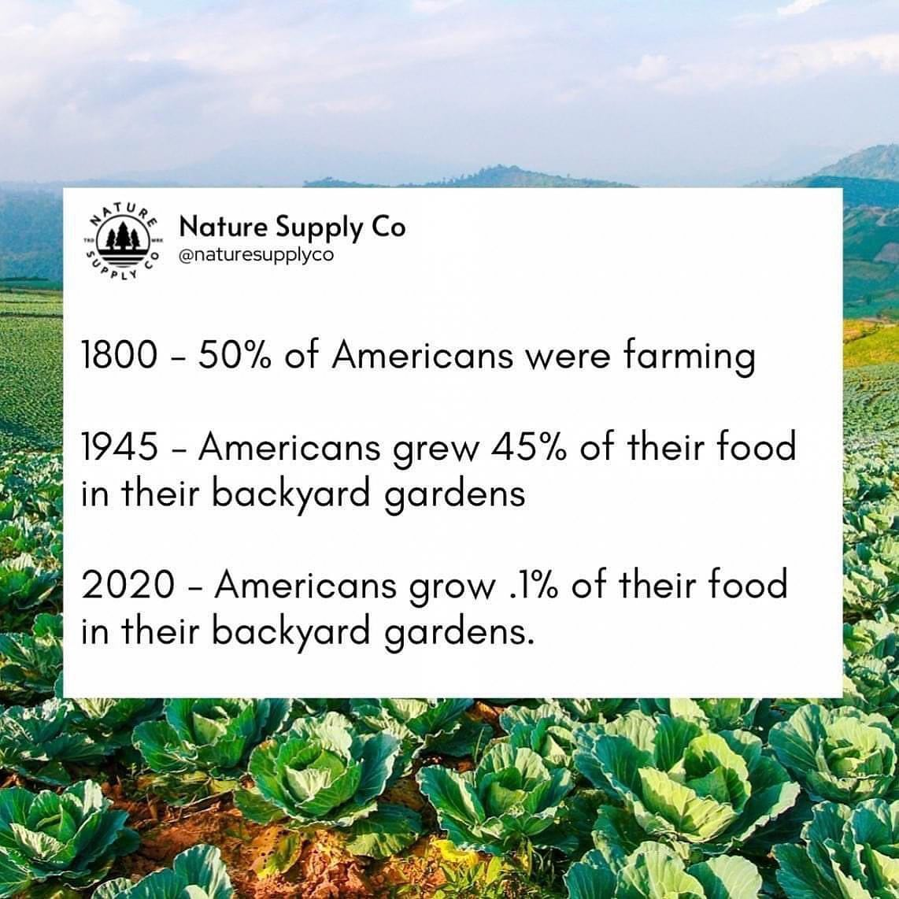

<h2>llama-3.2-vision</h2>

This meme is a humorous take on the changing nature of food production and consumption in the United States. It presents a series of increasingly absurd and humorous statements about the history of American food habits, starting with a 19th-century scenario where 50% of Americans were farmers, followed by a 1945 scenario where Americans were growing 45% of their food in their backyards, and finally a 2020 scenario where Americans were growing 0.1% of their food in their backyards. The text is presented in a playful, tongue-in-ear  style, with the company&#x27;s name and a  @naturesupplyco  handle. The text is presented in a playful, tongue-in-ear  style, with the company&#x27;s name and a  @naturesupplyco  handle.

<h2>first-seen</h2>

2023-05-10T21:03:35+00:00

<h2>tesseract</h2>

‘ setitmesanid nile a a 2 24% Nature Supply Co abe cae m  | 1800 - 50% of Americans were farming = == 1945 - Americans grew 45% of their food u coe ; Tes sea in their backyard gardens ake os s  2020 - Americans grow .1% of their food By met in their backyard gardens. ss vs ‘: Par sie al a &gt; hi &#125; Py a a ig ; ‘eS ws &gt; we AY. ST Yee SOP Sy Ce z o ” 2 aS we’ é =@ ‘eC 74 yi nt . er as oe  Dy ge ote I aca aS a Nios ah og &lt;F ge if SEMIS er. aS A “eae mL S8 , Ree f el, Sas, ae soi » bY Ws ry ~ D SS ree Pe Be RE NE ie oom

