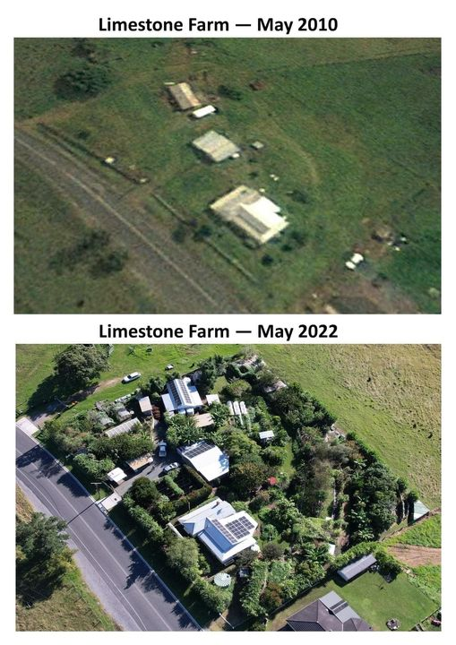

<h2>llama-3.2-vision</h2>

<i>Llama-3.2-Vision-11B is a really good model that probably gets the visual details right but doesn't understand literary or media references, and often fails to accurately represent the physical arrangement of objects and the implied relationships between the objects.</i>

This meme is a comparison of two aerial images of a farm, one taken in 2010 and the other in 2022. The top image shows a small, empty farm with a few buildings, while the bottom image shows a much larger and more developed farm with many more buildings and a large number of cars. The text above the images reads &quot;Limestone Farm - May 2010&quot; and &quot;Limestone Farm - May 2022&quot;.

<h2>first-seen</h2>

<i>Because Git doesn't preserve file modification times, this metadata file contains the file's modification time when it was added to the library.</i>

2023-05-12T02:50:22+00:00

<h2>tesseract</h2>

<i>Tesseract is often terrible and just gives a lot of nonsense characters, but it used to be the state of the art, and usually it is better at correctly representing text than llama-3.2-vision-11b.</i>

Limestone Farm — May 2010 \ sy =  Limestone Farm — May 2022 pS te e ‘Ss , SSS ee St x a SS ie 2 -$ De, eo So i 7 hr” Oe ME TRE een ~ XS ae 3 &quot; &quot; 3 Ee &gt;. ee he: Ay 4 boas He Seems \ PP se

