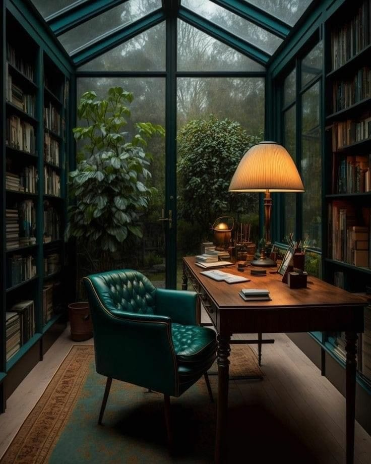

<h2>llama-3.2-vision</h2>

<i>Llama-3.2-Vision-11B is a really good model that probably gets the visual details right but doesn't understand literary or media references, and often fails to accurately represent the physical arrangement of objects and the implied relationships between the objects.</i>

The meme is a humorous image of a dimly lit, old-fashioned study with a desk, a chair, and a lamp. The text on the desk reads &quot;I&#x27;m not lazy, I&#x27;m just on energy-saving mode&quot;. The image is likely meant to poke fun at the idea of being &quot;on energy-saving mode&quot; as a way to avoid doing work or being productive.

<h2>first-seen</h2>

<i>Because Git doesn't preserve file modification times, this metadata file contains the file's modification time when it was added to the library.</i>

2023-05-20T15:21:01+00:00

<h2>tesseract</h2>

<i>Tesseract is often terrible and just gives a lot of nonsense characters, but it used to be the state of the art, and usually it is better at correctly representing text than llama-3.2-vision-11b.</i>

| | A. Ss / yl! Lg [ar eal? Ar  | ME tN a eee i Me ese eee LA aoe  ’ eh mS u Zi Es pa A VE 2 | i

