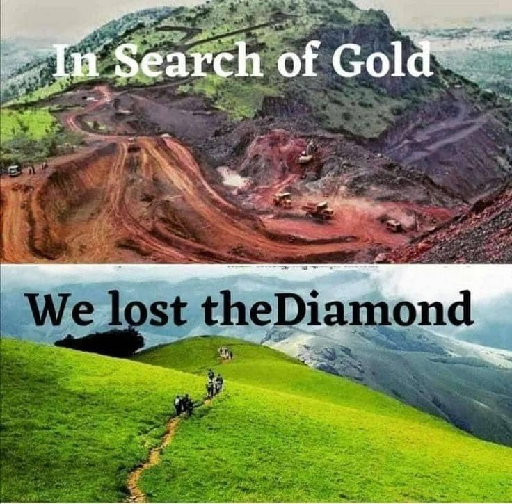

<h2>llama-3.2-vision</h2>

The meme is a humorous comparison between two movie titles. The top image is a mining scene, with the text &quot;In Search of Gold&quot; above it. The bottom image is a scene of people walking through a green field, with the text &quot;We lost the diamond&quot; above it. The meme is poking fun at the idea that the second title is a more accurate description of what happened in the first movie.

<h2>first-seen</h2>

2023-05-20T15:23:40+00:00

<h2>tesseract</h2>

Pe, i a ag Bart | RS on ha So We lost theDiamond = a St y. es as

