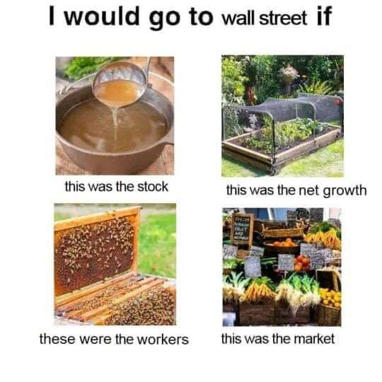

<h2>llama-3.2-vision</h2>

This meme is a humorous take on the idea that one&#x27;s investment portfolio would be better off if they were to live in a different time and place. The text at the top reads &quot;I would go to Wall Street if...&quot; and the four images below show different scenarios, with the corresponding text: &quot;this was the stock market&quot;, &quot;this was the net growth&quot;, &quot;these were the workers&quot;, and &quot;this was the market&quot;. The meme is poking fun at the idea that one&#x27;s financial situation would be better if they were to live in a different time and place, with each image showing a different scenario.

<h2>first-seen</h2>

2023-05-22T01:42:14+00:00

<h2>tesseract</h2>

| would go to wallstreet if oe oA Lie as a Ss Lin a ba this was the stock this was the net growth = Geman eg ieee ake ie ees ’ ee 7 \ these were the workers this was the market

