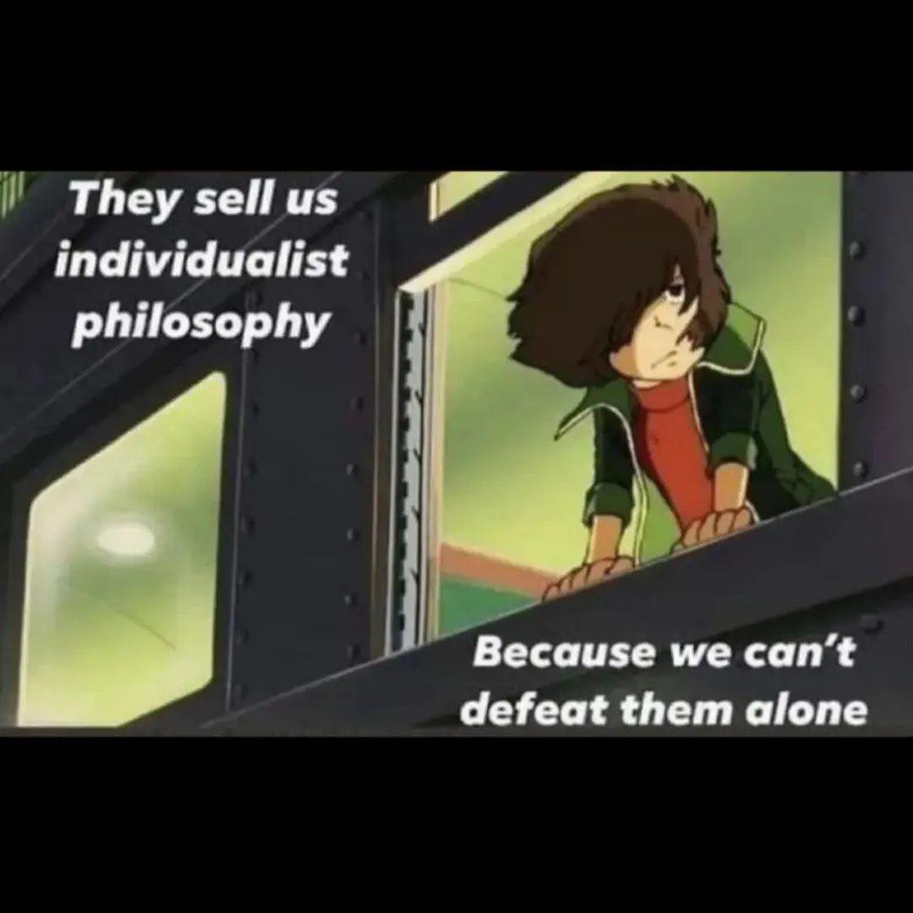

<h2>llama-3.2-vision</h2>

This meme is a humorous take on the concept of individualism and the idea that it can be a self-fulfilling prophecy. The text on the left says, &quot;They sell us individualist philosophy,&quot; and the text on the right says, &quot;Because we can&#x27;t defeat them alone.&quot; The image is likely a still from a popular anime or cartoon, showing a character looking out of a window or a window-like structure, with a determined or sad expression. The character is likely a protagonist or hero, and the image is meant to convey the idea that even when we are alone, we can still be a threat to others.

<h2>first-seen</h2>

2023-06-20T21:27:37+00:00

<h2>tesseract</h2>

ee en TMC [TLE r f philosophy © | 1 BP | | Because we can’t i. a Peete eld)

