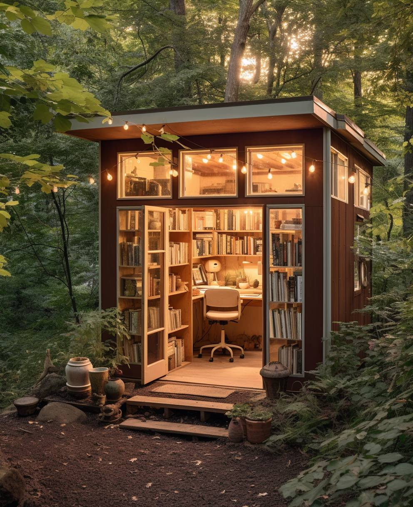

<h2>llama-3.2-vision</h2>

The meme is a humorous image of a small, cozy cabin in the woods, with a desk and chair in the center. The text &quot;I&#x27;m not lazy, I&#x27;m just on energy-saving mode&quot; is written on a sign above the desk. The image is meant to poke fun at the idea of being &quot;lazy&quot; by presenting it as a legitimate, environmentally-friendly option.

<h2>first-seen</h2>

2023-05-22T01:22:41+00:00

<h2>tesseract</h2>

Me een ee se a See  A Sie: REO  SB ee gle Po Seo) hn eee  ee Ee. Rae os ey) al Me)  | hw |e Filo an PaLe  ; 4 ee a =&gt; 2 : Ke ; Net 200 meee  ui) p f A&#125; a ~  ce Es — es. Ee

