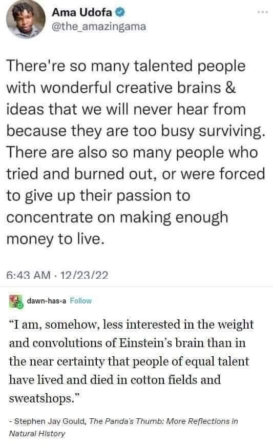

<h2>llama-3.2-vision</h2>

This meme is a humorous quote from a book, juxtaposed with a tweet from a famous person. The quote, from &quot;The Panda&#x27;s Thumb&quot; by Stephen Jay Gould, is a witty and satirical commentary on the relationship between intelligence and physical ability. The tweet from &quot;The Amazing&quot; (Ama) Udofa is a humorous observation on the importance of creativity and talent in the face of adversity.

<h2>first-seen</h2>

2023-05-18T19:01:53+00:00

<h2>tesseract</h2>

© Ama Udofa @ @the_amazingama There&#x27;re so many talented people with wonderful creative brains &amp; ideas that we will never hear from because they are too busy surviving. There are also so many people who tried and burned out, or were forced to give up their passion to concentrate on making enough money to live. 6:43 AM - 12/23/22 , dawn-has-a Follow “Tam, somehow, less interested in the weight and convolutions of Einstein&#x27;s brain than in the near certainty that people of equal talent have lived and died in cotton fields and sweatshops.” - Stephen Jay Gould, The Panda&#x27;s Thumb: More Reflections in Natural History

