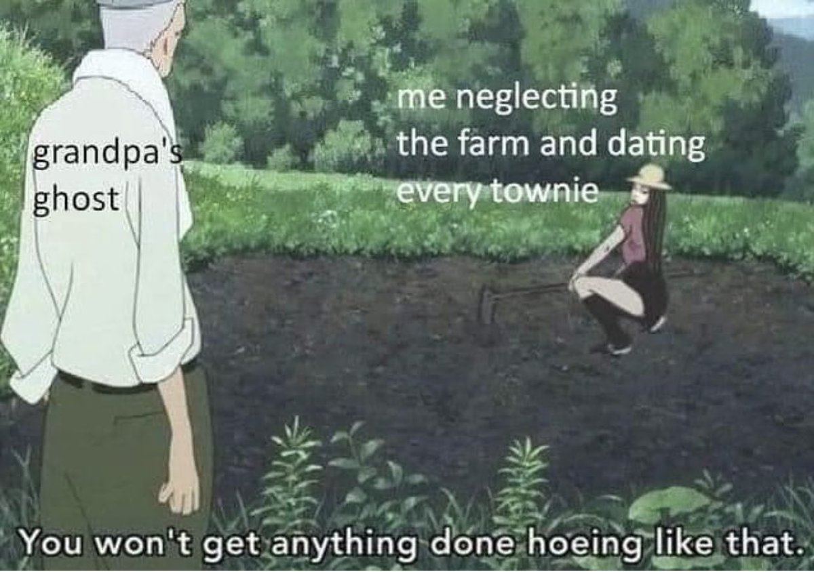

<h2>llama-3.2-vision</h2>

This meme is a humorous and satirical take on the idea of dating in the modern era. The image shows an old man (Grandpa) watching a young woman (the &quot;me&quot; in the meme) working in a field, with a caption that reads &quot;You won&#x27;t get anything done, you&#x27;re just going to get in the way.&quot; The text on the image reads &quot;Me, every time I&#x27;m trying to work on a project&quot; and &quot;You won&#x27;t get anything done, you&#x27;re just going to get in the way.&quot;

<h2>first-seen</h2>

2023-10-20T21:11:15+00:00

<h2>tesseract</h2>

“ee (49 Boe Oe oe a ee aetna a fet ide Pere = yi ” SIPeutte0 «. eee the farm and dating &#123; /&#125; ghost | Pheaty ee ee ee — a 4 Coy enemas? x&#125; hi; fred a p i bs | Cee ee eer Mia? t , ; F y a ee  “You won&#x27;t getanything done-hoeingylike that~ ‘ . Et aro Se ee

