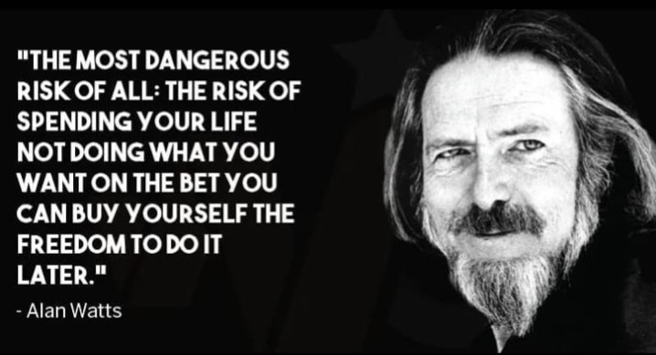

<h2>llama-3.2-vision</h2>

The image features a quote from Alan Watts, a philosopher and writer, alongside a black-and-white photograph of him. The quote is displayed in white text on a black background, reading: &quot;THE MOST DANGEROUS RISK OF ALL: THE RISK OF SPENDING YOUR LIFE NOT DOING WHAT YOU WANT ON THE BET YOU CAN BUY YOURSELF THE FREEDOM TO DO IT LATER.&quot; Below the quote, in smaller white text, is the attribution &quot;- Alan Watts&quot;. The image is cropped at the top and bottom, with only a portion of Alan Watts&#x27; face visible in the photograph.

<h2>first-seen</h2>

2023-05-25T20:22:42+00:00

<h2>tesseract</h2>

a ey cla Celt  Cog Vera aol \“ Shana j 3 NOT DOING WHAT YOU aa = &#125; ike hae elu | i UA Sana ao FREEDOM TODOIT 5 oan da  WN ae iy |  CUR elec So g

