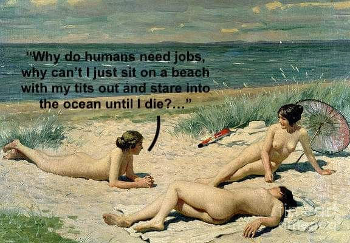

<h2>llama-3.2-vision</h2>

This meme is a humorous commentary on the societal expectation of needing a job. It features an image of three women on a beach, but instead of being in a beach setting, they are actually in a painting of a beach, and they&#x27;re all nude. The text at the top of the image reads, &quot;Why do humans need jobs, why can&#x27;t I just sit on a beach with my tits out and stare into the ocean until I die?&quot; The image is a satirical take on the idea that people are forced to work for a living, and it&#x27;s meant to be humorous and relatable.

<h2>first-seen</h2>

2023-05-25T18:03:09+00:00

<h2>tesseract</h2>

= r eT ee i —— wes eg SE sa a Ss a a ee ee ——Why ce an’ just sit on-z reach ee Se r = matey, i ~~ the ocean untiltdie?.&quot; 5. ee &amp; &lt;a! amas pw aes ee Se = Ne Ser Ee ace wey te j — : j : ie yo

