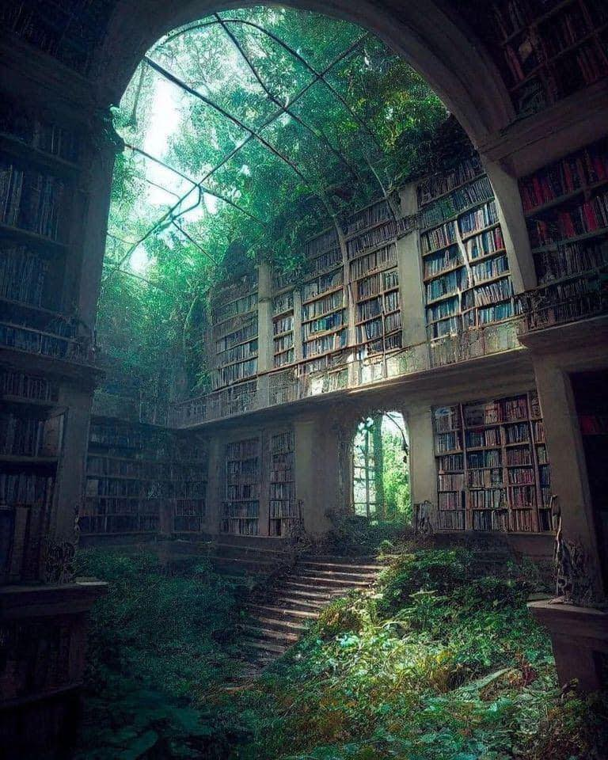

<h2>llama-3.2-vision</h2>

The meme is a humorous image of a library with a large, abandoned library with a massive, overgrown library with a large, overgrown library with a large, overgrown library. The text in the image reads: &quot;I&#x27;m not arguing, I&#x27;m just explaining why I&#x27;m right.&quot; The image is meant to be humorous and ironic, poking fun at the idea of a library being a place of learning and knowledge, but instead being a place of overgrowth and decay.

<h2>first-seen</h2>

2023-05-31T00:51:24+00:00

<h2>tesseract</h2>

i So ; Ne a Re CY Lo ae SS me : Sa Ae ea P Re ee . Y ter ; \ gales Noss : Pe ee! te a | eg 490 fil ae “1 : ne BN ee an he fe ie, eS i ig i ti Pe oS ee Ee aati hee it | a. G\ pe ir MN ie. Vere, f : ie&#125; vil &quot; CU ee a Ceo RE ere A ir : Pi Soe, Jy VE &#x27; aT a Ny — ee . ee — =&quot; ara PE Sa i a oo ee Be ee Gi Reed Rieti eg Ll ea SAB ee ee een ta = ae pao By Be cee DE ApS el ON Nee ee ase eg I See ris ie sees ‘ tac ates tie Ca a ig tans

