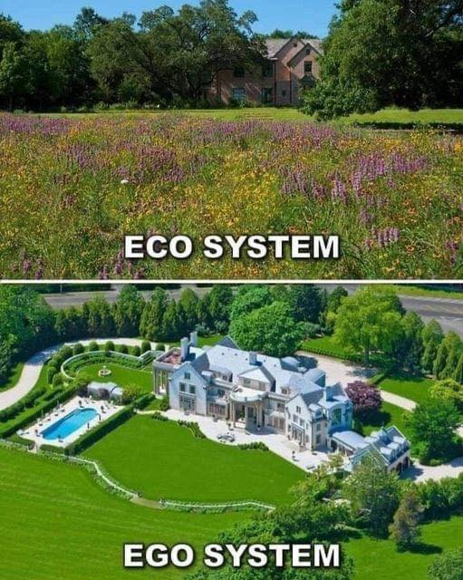

<h2>llama-3.2-vision</h2>

<i>Llama-3.2-Vision-11B is a really good model that probably gets the visual details right but doesn't understand literary or media references, and often fails to accurately represent the physical arrangement of objects and the implied relationships between the objects.</i>

The meme is a visual joke that contrasts two types of gardens: a wild, untamed &quot;Eco System&quot; (with a house in the background) and a well-manicured, luxurious &quot;Ego System&quot; (with a grand house and pool). The text at the top reads &quot;Eco System&quot; and at the bottom reads &quot;Ego System&quot;. The humor comes from the idea that the two types of gardens are so different in style and quality, with the &quot;Ego System&quot; being a symbol of wealth and excess.

<h2>first-seen</h2>

<i>Because Git doesn't preserve file modification times, this metadata file contains the file's modification time when it was added to the library.</i>

2023-05-31T23:19:30+00:00

<h2>tesseract</h2>

<i>Tesseract is often terrible and just gives a lot of nonsense characters, but it used to be the state of the art, and usually it is better at correctly representing text than llama-3.2-vision-11b.</i>

Ben poy ula) ny : se gps a — fmt hee Peace) pros ae ee ee f.., &lt;&lt; se iss “ 4 EGO SYSTEM

