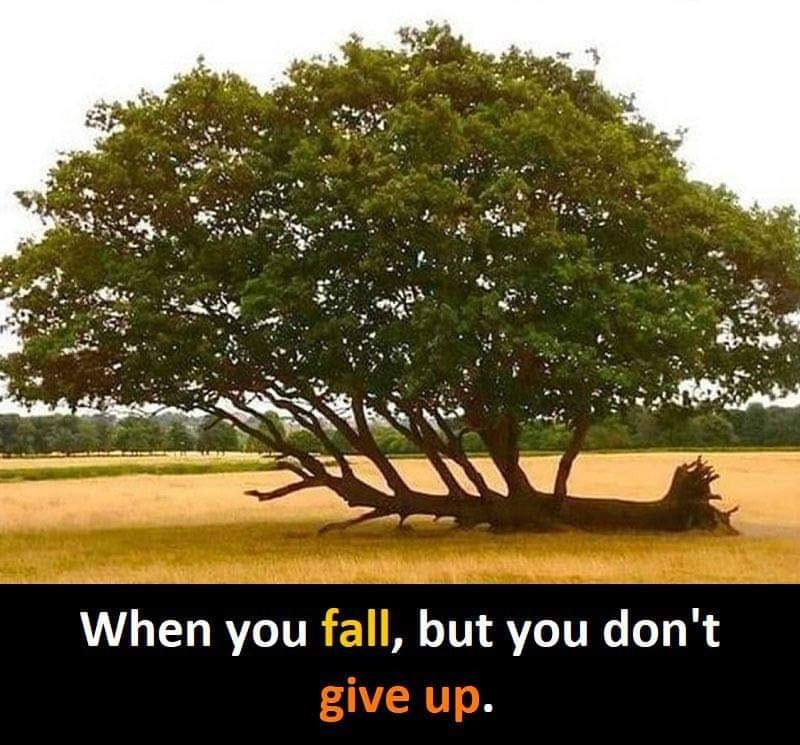

<h2>llama-3.2-vision</h2>

This meme is a visual joke that uses a picture of a tree that has fallen over, but still has a few branches and leaves that are still alive. The text that appears in the image says &quot;When you fall, but you don&#x27;t give up&quot; and is written in a way that the word &quot;fall&quot; is in a different color than the rest of the text, and the word &quot;don&#x27;t&quot; is in a different color than the rest of the text. The meme is making a humorous point about perseverance and resilience.

<h2>first-seen</h2>

2023-05-31T23:21:09+00:00

<h2>tesseract</h2>

a Ps aS : * om oe 8 2 : a : Sg, 5 i ie, ; 2 e s Pam ais ar : ; rode a x Renee Bees eS ak Pi ao xe at $$$ Dal When you fall, but you don&#x27;t

