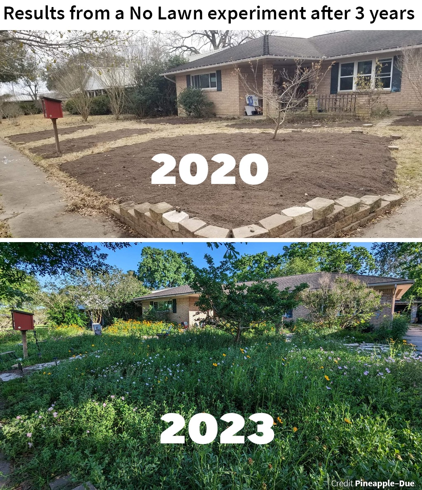

<h2>llama-3.2-vision</h2>

<i>Llama-3.2-Vision-11B is a really good model that probably gets the visual details right but doesn't understand literary or media references, and often fails to accurately represent the physical arrangement of objects and the implied relationships between the objects.</i>

The meme is a humorous comparison between a lawn that has been left unattended for three years and a lush, overgrown garden. The top image shows a barren, weed-covered lawn with a few bare trees, while the bottom image shows a vibrant, flowering garden with a variety of plants and trees. The text at the top reads &quot;Results from a No Lawn experiment after 3 years&quot; and the bottom image has the year &quot;2023&quot; written on it.

<h2>first-seen</h2>

<i>Because Git doesn't preserve file modification times, this metadata file contains the file's modification time when it was added to the library.</i>

2023-05-31T23:21:14+00:00

<h2>tesseract</h2>

<i>Tesseract is often terrible and just gives a lot of nonsense characters, but it used to be the state of the art, and usually it is better at correctly representing text than llama-3.2-vision-11b.</i>

Results from a No Lawn experiment after 3 years Bees ely Sept 7 a9 &gt; PSR WIC coe Sia a= ss Se Da | FA mae iis ce een ee A wach &lt;ae Mw &lt;7 ay RA We eee Cee cn eae \ ows os aaa a&quot; — 1 Zi, &quot; = YAY) k _ ety CL ee eo en — BN ae Pe iene nn samaaent heen rom . a eet &quot;2 ee ee) a ee el ee ee ee See Se : eae ase ee ee Ba —— - Se Ses ess eS ee = e a ee Cg ie a ea &lt; &lt;e Be a0 ae . &lt;&lt; - re. ae aes . SERS EERE a ae LEME IERIIE soe PRTEE eS ae ee ee 7 ot: cee mee Beste SR TEE ent St A ase a ee ee ONS ee El ee pee ee ee C Soret Pi a Se ee — 5 Be ene fo Rae eg eee dR Ar A ee ee OP np cman me oc ae ee “a OE i a aa ee Me: ae = Sa : ee er 3 = et ee Oe es rn en arash? Ae EE eae a ge SNe: aes aes ee ee wee Ce Steg ae ‘ee? Pans pa thlen gata A Pai tae) apa tee sea henge ay ARR Cea ts be Aer genaial 8 ey at i Pa ORE So le Po Ea. Get aa i ‘i ee ig AA cana as ey CRO, i Bela AK RANE Rae KS ANGI eS da aeeatl (ALAWA Be ts Ne By Se NAN aS re i a saan Peed \.-\ Crédit Pineapple-Due

