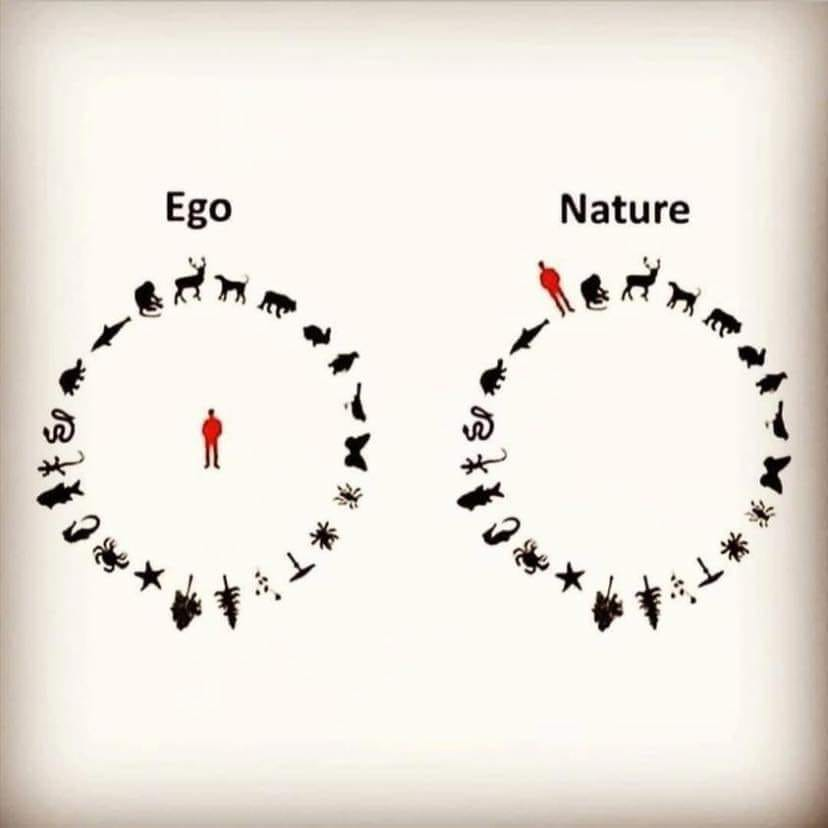

<h2>llama-3.2-vision</h2>

This meme is a visual representation of the relationship between ego and nature. The image shows a person (Ego) at the center, surrounded by various animals and objects, which are connected to the person. The text &quot;Ego&quot; is above the person, and &quot;Nature&quot; is above a separate circle of animals and objects, which are connected to it. The idea is that the person&#x27;s ego is separate from and connected to the natural world, but also connected to it through various animals and objects.

<h2>first-seen</h2>

2023-06-15T22:29:03+00:00

<h2>tesseract</h2>

| 7 | | Ego Nature an er  y* » om € * € w ® Rf « 2» 4 a x we x | , ¥ * , ‘  * ‘ Ky yn a ee

