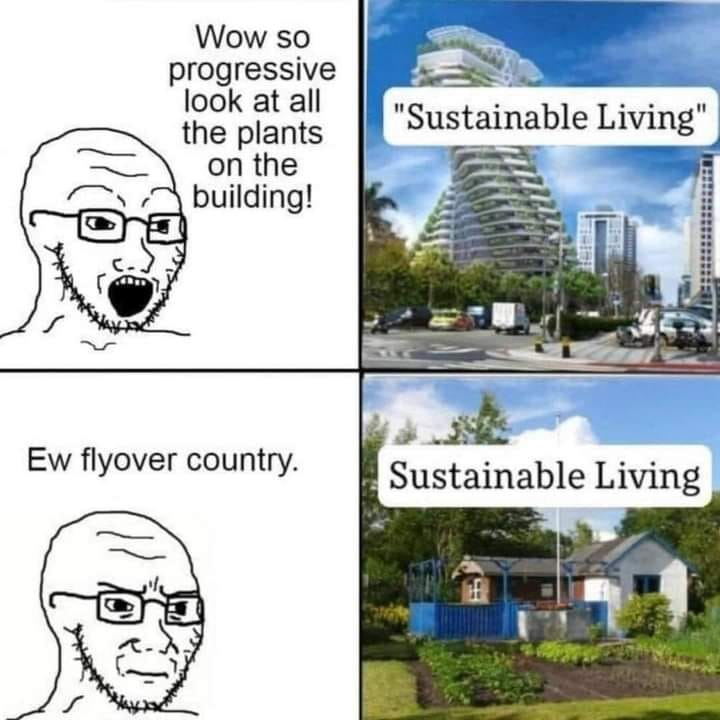

<h2>llama-3.2-vision</h2>

This meme is a humorous commentary on the idea of &quot;sustainable living&quot; in a hyper-ironic and satirical way. The first panel shows a person marveling at the plants on a building, with the text &quot;Wow, so progressive!&quot; The second panel shows a person looking at a small house in a garden, with the text &quot;Ew, flyover country.&quot; The meme is poking fun at the idea that &quot;sustainable living&quot; is often associated with high-end, modern, and luxurious buildings, while &quot;sustainable living&quot; in a small, rural, or &quot;flyover&quot; area is often seen as a less-appearing, less-pleasing, and less-pleasant place.

<h2>first-seen</h2>

2023-06-20T22:10:46+00:00

<h2>tesseract</h2>

Wow so Bia, progressive |iPs—s&lt; fre viet ” Sustainable Living&quot; “= onthe B= i 7 ~s ¢~\ building! aa i ove %- — c-) 3 ee Nik # A ) ) «| t Ped, ie = —— _+— ys a8 Sot HR SEIT # Sustainable Living — a o ; a F STE F i 1 Pe | ADS : cco Tf .

