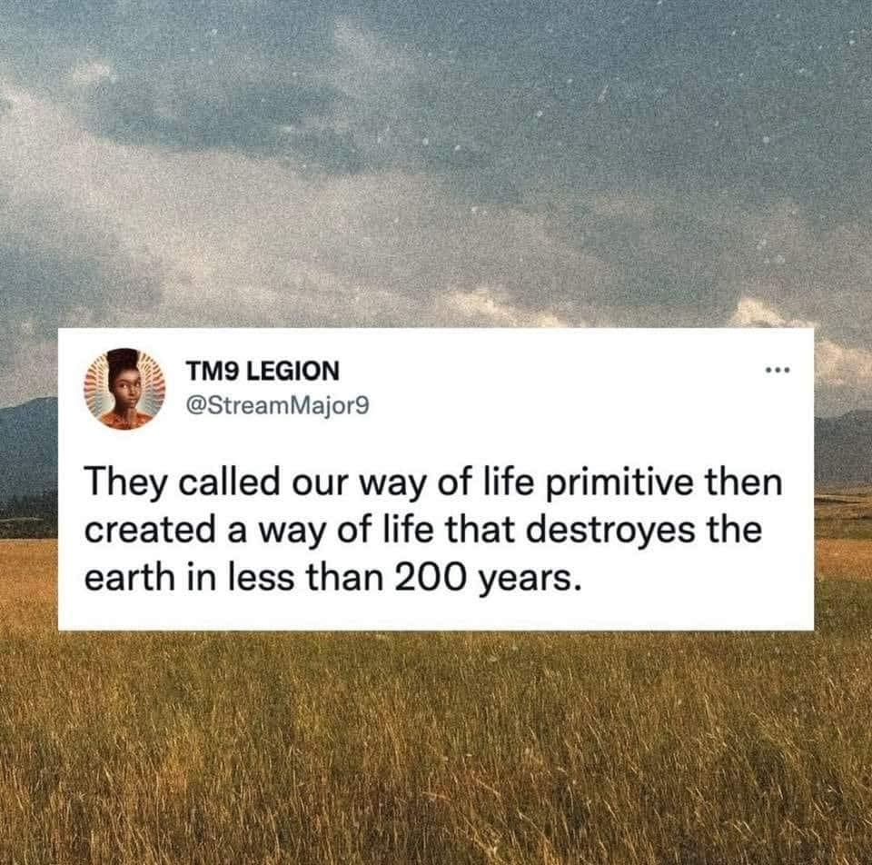

<h2>llama-3.2-vision</h2>

This meme is a humorous commentary on the way of life of our ancestors. The text reads: &quot;They called our way of life primitive, then created a way of life that destroys the earth in less than 200 years.&quot; The image is likely a simple, dark background with a small, circular icon of a person, possibly a cartoon or a real person&#x27;s photo, but the text is the main focus.

<h2>first-seen</h2>

2023-06-27T19:47:58+00:00

<h2>tesseract</h2>

Bigeaiee ditt ia ee gesmestet ed ene oe BL erm Sf Two LeEcIon - ae a @StreamMajor9 i They called our way of life primitive then created a way of life that destroyes the earth in less than 200 years.

