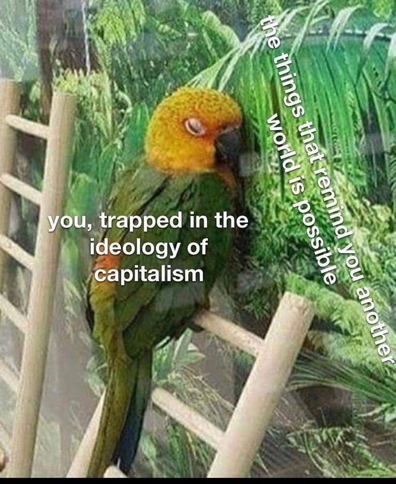

<h2>llama-3.2-vision</h2>

This meme features a parrot with a shocked expression, captioned &quot;you, trapped in the ideology of capitalism&quot; and &quot;the things that remind you another world is possible&quot;. The image is meant to be humorous and relatable, poking fun at the idea that even in a capitalist society, there are still people who are aware of and want to change the system. The parrot&#x27;s expression is meant to convey a sense of surprise and wonder at the idea of an alternative world, which is a common feeling for those who are aware of the problems of capitalism and want to change it.

<h2>first-seen</h2>

2023-06-27T05:39:22+00:00

<h2>tesseract</h2>

Ba et a Not AY a) ye f ‘% \ Seg v3 [a2 f= ON OG al ahs i SYNE yy! Me “(ene 4 AN a NaN \K Rl gpI Ne ay  Dig eA Bao Nees AHN’ : WN hy wT slg che i A a, , 4 by bY Va) |  by Mee i NE poh  MMe in the *. re aN A Micleleeten of PERE. ze . : sy Vv oe i : 7 Weeliciicnn Bee aie a) | » &#123; ea. 7 eo ‘ oa . NE ea? - t i oval sia &gt; 7 — j 4 | Bo yy en a 4 ‘a B: SS j y » iy cae ey uae My ol Rid gir As x Rh  i Pes NS Cae woke MB Nis

