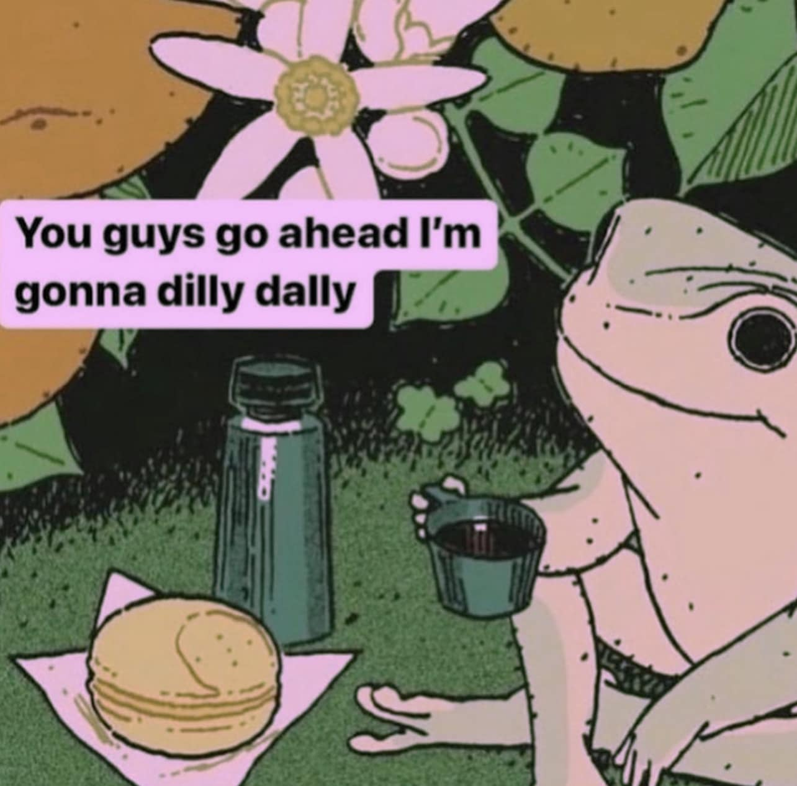

<h2>llama-3.2-vision</h2>

This meme is a humorous image of a character from the animated TV series &quot;Simpson&#x27;s&quot; named &quot;Bart&quot; from the episode &quot;The Bart-It-All&quot; in 1993. The character is depicted with a sandwich and a drink, and the text &quot;You guys go ahead, I&#x27;m gonna dilly dally&quot; appears above it. The phrase is a play on words, using the phrase &quot;dilly dally&quot; which means to delay or put off something.

<h2>first-seen</h2>

2023-07-03T23:03:30+00:00

<h2>tesseract</h2>

ho. oa q = f] You guys go ahead I&#x27;m | y: . 7 J NF a gonna dilly dally eae * yj - 5 . Se e = ‘4 va * Sane pe “ f es K ai ut ‘ APR Ve &#125; ees oes BN ev ; Shes esa ; “ BP PS? a geek &#x27; 7 — a grens | ; tee ea SBS ¢ . Sareea Sf ‘ _ ; ee a iF are foi a ai) ome Ee hrs Ie See &#x27;y? /j - bal AS ita a as eo eg ig Beh ede Fi a oe wl Fl .

