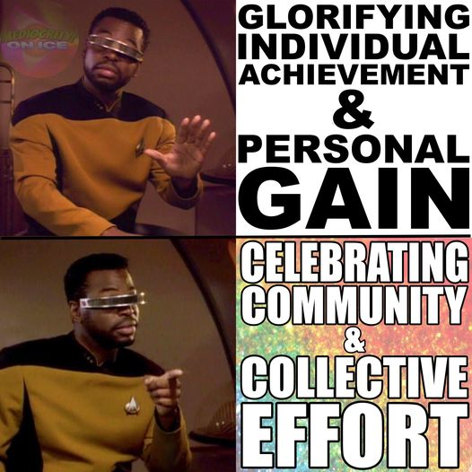

<h2>llama-3.2-vision</h2>

This meme is a humorous take on the concept of &quot;personal gain&quot; versus &quot;community effort.&quot; The image features two panels of the character Jean-Luc Picard from Star Trek: The Next Generation, but with his face replaced with a &quot;meme face&quot; expression. The first panel shows him looking confused, while the second panel shows him looking triumphant. The text in the first panel reads &quot;Glorifying Individual Achievement &amp; Personal Gain,&quot; while the second panel reads &quot;Celebrating Community &amp; Collective Effort.&quot; The meme is poking fun at the idea that people often prioritize individual success over collective success, and the image is meant to be humorous and relatable.

<h2>first-seen</h2>

2023-07-06T00:20:23+00:00

<h2>tesseract</h2>

: GLORIFYING = INDIVIDUAL ACHIEVEMENT m8 GAIN aT UIT eS af deg EFFORT

