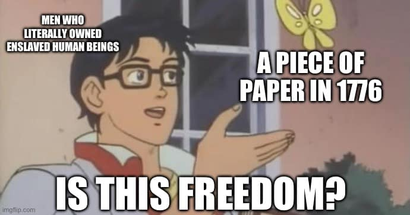

<h2>llama-3.2-vision</h2>

This meme is a play on the phrase &quot;is this a joke?&quot; It features a character from the anime &quot;Lucky Star&quot; in a state of confusion, with a speech bubble saying &quot;Is this freedom?&quot; The text at the top reads &quot;Men who literally owned enslaved human beings&quot; and the text at the bottom reads &quot;A piece of paper in 1776.&quot; The meme is a commentary on the irony that the US Declaration of Independence, which is often seen as a symbol of American freedom, was written by and for people who owned slaves. The character&#x27;s confusion and question is a humorous way of pointing out the hypocrisy of the founding fathers.

<h2>first-seen</h2>

2023-07-04T18:49:40+00:00

<h2>tesseract</h2>

fcelvaneen XK an LEN EV UE Tay Mp. fi PITTA: ‘iy; yy Rc , z A y F , IS THIS FREEDOM?

