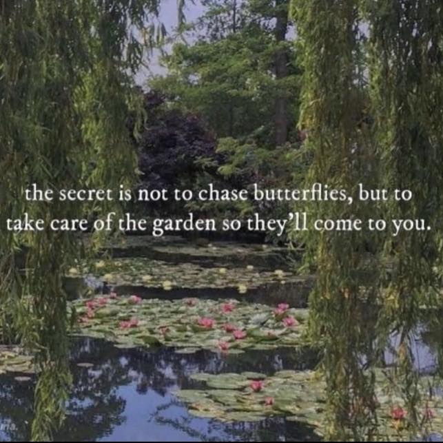

<h2>llama-3.2-vision</h2>

This meme is a humorous image that juxtaposes a serene and peaceful scene of a pond with a famous painting by Claude Monet, &quot;The Water Lilies,&quot; with a quote that seems to be a misquote of the actual quote &quot;The more I learn, the more I realize how much I don&#x27;t know.&quot; The actual quote is not present in the image. The actual quote is a quote from the famous artist, and the image is a quote from the famous artist.

<h2>first-seen</h2>

2023-07-21T00:13:15+00:00

<h2>tesseract</h2>

Bane Tai Bea TE” ‘i yi BOG D r, ey nT 4 Fon ‘ ar écsos Le ,) ee SELLS Seggac &gt; aaa! ARPS SN , Gay seers aaa ts, i acy a RO oe Bice! a eso 4 your , F te i ae te 5 b fi; Fy tt nee ae) : a ke bial i F ~ a Pe 7 f \€ &gt; Ot Paavo eta Bia coRe emt iKc ot ae elt aice) take care of the garden so they&#x27;ll come to you. Sel IRL: reeeemee e e 2 i” Vi 7 f Phe eo ee “a i . 1 Sg ee I Ret RR mae a et ee ND wares) == ae rho? Sr 4 aM ie Re pa Sa a Se ey % i Se ; oH &quot; 24 = se od i, &gt; ) ae ae ee

