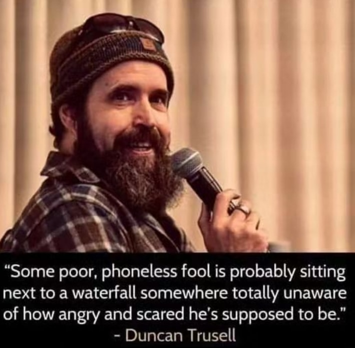

<h2>llama-3.2-vision</h2>

This meme is a humorous image featuring comedian and actor Brian Johnson, known for his &quot;I&#x27;m not a [insert job] I&#x27;m a [insert job]!&quot; catchphrase. The image shows Johnson with a serious expression, and the text &quot;I&#x27;m not a doctor, I&#x27;m a doctor&quot; is written below. The meme is a play on the idea that someone&#x27;s job title is not what they&#x27;re actually doing, but rather what they&#x27;re not.

<h2>first-seen</h2>

2023-07-28T21:57:19+00:00

<h2>tesseract</h2>

; é hy ea  — x - oe m *y i“ a ‘ SN i i, oe - A Se ; “Some poor, phoneless fool is probably sitting next to a waterfall somewhere totally unaware of how angry and scared he&#x27;s supposed to be.” - Duncan Trusell

