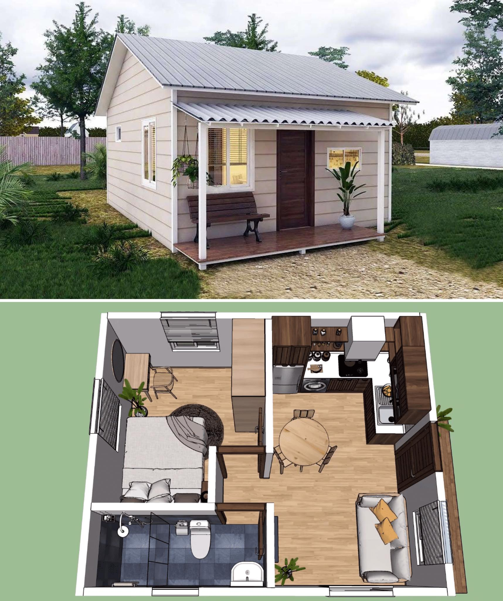

<h2>llama-3.2-vision</h2>

<i>Llama-3.2-Vision-11B is a really good model that probably gets the visual details right but doesn't understand literary or media references, and often fails to accurately represent the physical arrangement of objects and the implied relationships between the objects.</i>

The meme is a visual representation of a tiny house with a large, empty space inside. The text &quot;I don&#x27;t have a tiny house, I have a tiny mind&quot; is written above the image, implying that the person&#x27;s mind is so small that they can&#x27;t even fill the tiny house. The joke is that the person&#x27;s mind is so small that it&#x27;s not even a match for the tiny house, making it a humorous and relatable observation.

<h2>first-seen</h2>

<i>Because Git doesn't preserve file modification times, this metadata file contains the file's modification time when it was added to the library.</i>

2023-07-28T19:38:10+00:00

<h2>tesseract</h2>

<i>Tesseract is often terrible and just gives a lot of nonsense characters, but it used to be the state of the art, and usually it is better at correctly representing text than llama-3.2-vision-11b.</i>

nf. St RY vs x e- ee % E be »: “4 i aw be Z oie a 7 aaa. CF vet ee ee ae ‘ aco «Oa : f iS = . Wie) one ppd roe. ey Sn re i AAO A nn nn nn 2 P a eae | a = | — TATA Te = LK 4 | ii | ] (10111 a j i di ttt be ee oe ith i ith Hil es | == &#x27; | a See a Ss a - MN Ne a = ES 2 fy ee =e eee os ———S — = Sones —==—. . | a | == paw 1h =x i i He Ny i See : | eS z= or Ld .- vie WS ; Sy ] . ells | \ NU \ uy @ IW | \ Ks iy | ‘ 5 ih bs ! g | k ee i Th i Aw, | a | PA! 1 oN a i || Wa 5 a | (a Te a ie ; | ANE)! W)) ecstenlll SS, ai — | :

