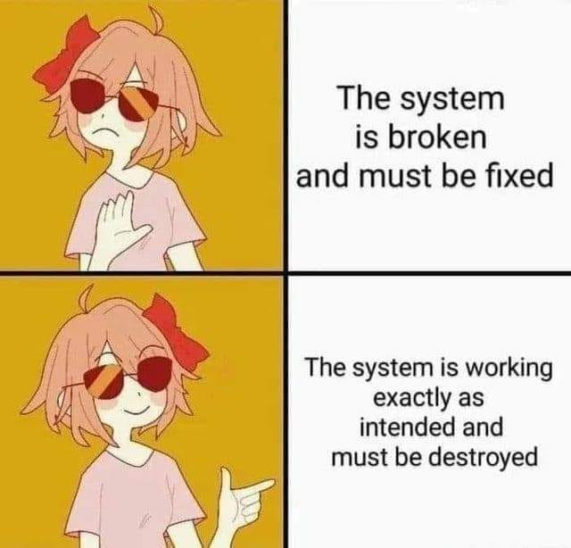

<h2>llama-3.2-vision</h2>

This meme is a humorous commentary on the relationship between a developer&#x27;s intentions and the actual outcome of their work. The image shows a character with a &quot;broken&quot; expression and a &quot;working as intended&quot; expression, with the text &quot;The system is broken and must be fixed&quot; and &quot;The system is working exactly as intended and must be destroyed&quot;. The meme pokes fun at the idea that a system can be both broken and working as intended at the same time, highlighting the absurdity of this situation.

<h2>first-seen</h2>

2023-07-28T19:33:28+00:00

<h2>tesseract</h2>

eo Fo AY \N 2 8., \ The system d, i JS i. ys i) = is broken ys and must be fixed = ip C~ / gv, Ze ti The system is working Zi — exactly as AS Gi - intended and y ~/ ar must be destroyed i CL &#x27;¢@

