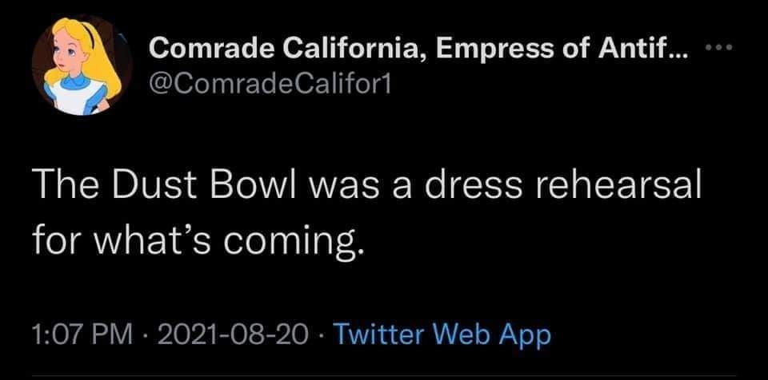

<h2>llama-3.2-vision</h2>

The meme is a screenshot of a tweet from the Twitter account &quot;Comrade California, Empress of Antarctica&quot; (a parody of the Disney character). The tweet reads: &quot;The Dust Bowl was a dress rehearsal for what&#x27;s coming.&quot; The text is presented in a simple, white font on a black background, with the Twitter account&#x27;s name and the date and time of the tweet (&quot;1:07 PM · 2021-08-20&quot;) displayed below. The tweet is a darkly humorous comment on the state of the world, implying that the devastating events of the 1930s (the Dust Bowl) were a precursor to the more catastrophic events that are currently happening.

<h2>first-seen</h2>

2023-09-11T12:59:32+00:00

<h2>tesseract</h2>

* Comrade California, Empress of Antif... °°: @ComradeCalifor1 The Dust Bowl was a dress rehearsal for what’s coming. 1:07 PM - 2021-08-20 - Twitter Web App

