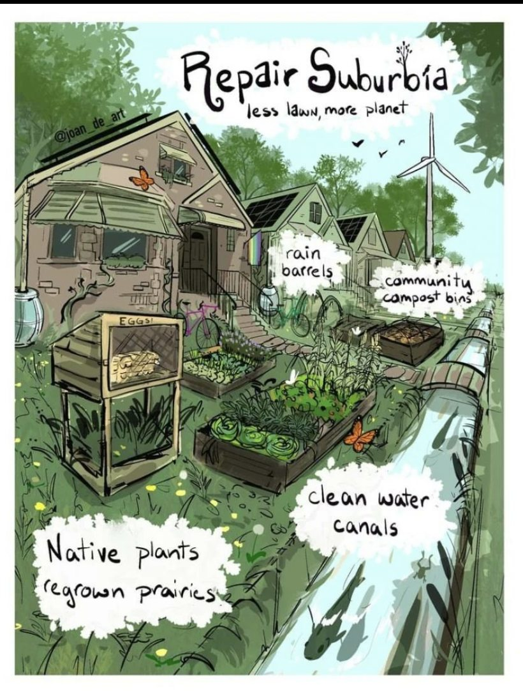

<h2>llama-3.2-vision</h2>

This meme is a humorous illustration of a suburban neighborhood that has been transformed into a sustainable, eco-friendly community. The text &quot;Repair Suburbia&quot; is written at the top, and the image shows a series of houses with solar panels, wind turbines, and a community garden. The text &quot;Less lawn, more planet&quot; is written at the bottom, and the image also includes labels such as &quot;rain barrels&quot;, &quot;community compost bins&quot;, &quot;clean water canals&quot;, and &quot;native plants&quot; to describe the various sustainable features of the community.

<h2>first-seen</h2>

2023-09-04T21:39:36+00:00

<h2>tesseract</h2>

ps BS) ie: mat jepair Suburbia tw , less lawn, more planet a &lt; ro FS ~~ \ Es iia, vy ot eo pas Zi (| Ve Y- \ | ZN Ya . m na FF cain SWE. | y , barrels Tl community, 5 Melty oot ik —— i i | Sal | a) / il 4 b Sk ot Cm f bd Ve aes Clean water 4 : ae © Canals Native Plant&#x27;s 1 j ¥ (earousn Prairies y j . eg e B/

