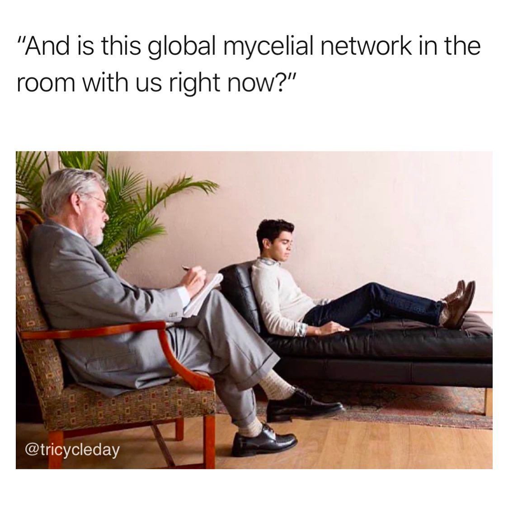

<h2>llama-3.2-vision</h2>

This meme is a humorous take on the current state of the internet. It features a photo of a therapist&#x27;s office, with the therapist and patient sitting on a couch, but with a twist: the patient is not sitting on the couch, but is instead lying on a couch-like bed that is actually a giant mushroom. The text above the image reads: &quot;And is this the global mycelial network in the room with us right now?&quot; The joke is that the therapist is asking a question that is both literal and metaphorical, referencing the idea that the internet is a global network of interconnected computers that can be thought of as a &quot;mushroom&quot; that is spreading and growing in the &quot;room&quot; of the internet.

<h2>first-seen</h2>

2023-09-24T22:25:19+00:00

<h2>tesseract</h2>

“And is this global mycelial network in the room with us right now?” ti () Sar N = ae a yy. 7 1 - iis. * \ — p &gt;A / # ms iN | . iD  gyal’ 13 9  @tricycleday , &amp; a =

