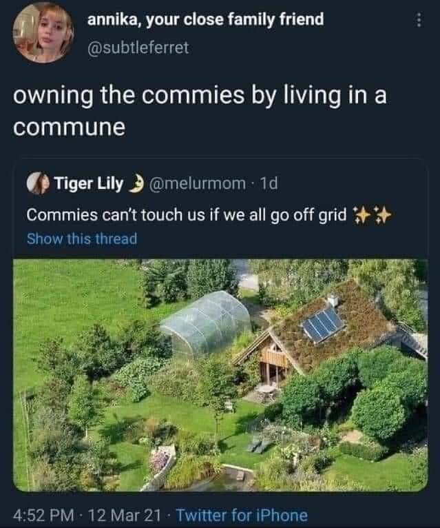

<h2>llama-3.2-vision</h2>

<i>Llama-3.2-Vision-11B is a really good model that probably gets the visual details right but doesn't understand literary or media references, and often fails to accurately represent the physical arrangement of objects and the implied relationships between the objects.</i>

The meme is a joke about the idea of a &quot;commune&quot; (a community living together) being taken over by a group of &quot;commies&quot; (a pejorative term for communists). The text in the image reads &quot;owning the commies by living in a commune&quot; and is followed by an image of a green, lush garden with a house and a greenhouse. The image is meant to be humorous and ironic, suggesting that the owners of the commune are actually the ones in charge, rather than the &quot;commies&quot; they are trying to control.

<h2>first-seen</h2>

<i>Because Git doesn't preserve file modification times, this metadata file contains the file's modification time when it was added to the library.</i>

2023-10-13T03:22:44+00:00

<h2>tesseract</h2>

<i>Tesseract is often terrible and just gives a lot of nonsense characters, but it used to be the state of the art, and usually it is better at correctly representing text than llama-3.2-vision-11b.</i>

r ),_annika, your close family friend H Se (OR irae owning the commies by living in a commune @) Tiger Lily 3 @melurmom: id Commies can&#x27;t touch us if we all go off grid +&gt; Show this thread Phan a a a en Oe Sevugatcaae ae Ae - Pe a he hp ae me gid Bo 3 hee ee Le a a &gt; B eee eae a ‘ , ce od ee rer + a ae re oe ga UB ee i . — we - Oi oie sacl Se ee ae = isha i cited 4:52 PM: 12 Mar 21 - Twitter for iPhone

