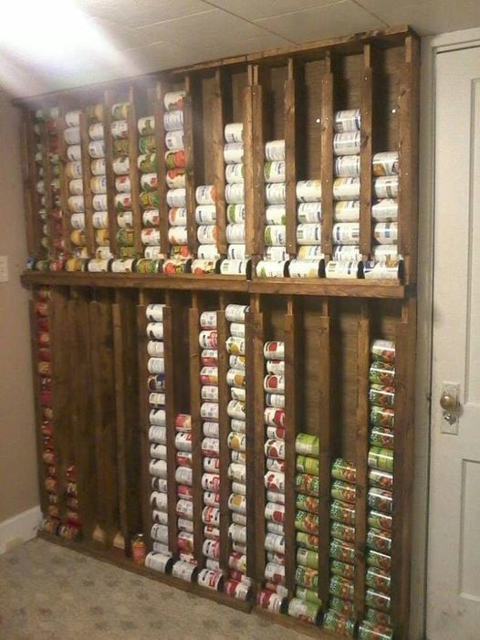

<h2>llama-3.2-vision</h2>

The meme is a photo of a wall with shelves that have been converted into a storage space for canned goods. The shelves are filled to the brim with cans of food, with some even spilling over onto the floor. The text &quot;I&#x27;m not hoarding, I&#x27;m just stockpiling&quot; appears at the top of the image.

<h2>first-seen</h2>

2023-10-21T17:32:25+00:00

<h2>tesseract</h2>

a mr oT | ‘ a rt eb ry Pe | ttre ee a Te : x ato . eee = si | H fe Lae ret ce © cre ors EH ae | &lt;a CPEs . ORE 3 a

