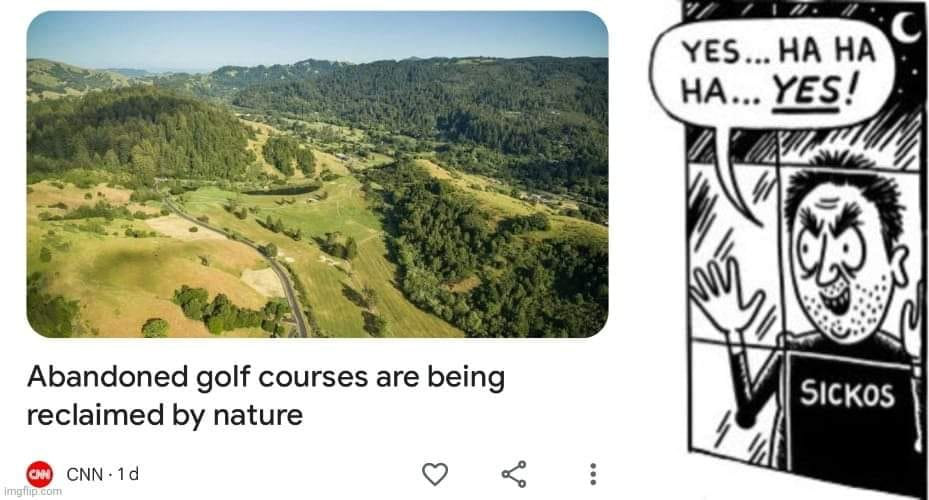

<h2>llama-3.2-vision</h2>

This meme is a joke about a news article about abandoned golf courses being reclaimed by nature. The text &quot;Abandoned golf courses are being reclaimed by nature&quot; is shown above a picture of a golf course. Below the text is a comic strip of a man who says &quot;Yes... ha ha ha... yes!&quot; as he watches a golf course being reclaimed by nature, but his name &quot;Sickos&quot; is written on a sign in the background, implying he&#x27;s the one responsible for the golf course being abandoned.

<h2>first-seen</h2>

2023-11-04T20:58:49+00:00

<h2>tesseract</h2>

i : . YES...HA HA C Ra ai a é ‘ HA... Yes! Pit can = &lt; bois VA a Whiff , &amp;* ; 2 &lt;i NY ) Ee er NA Sie Abandoned golf courses are being J SICKOS 1 reclaimed by nature i @ cnn-id 9 &lt; ;

