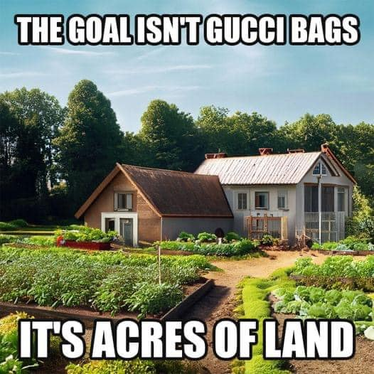

<h2>llama-3.2-vision</h2>

<i>Llama-3.2-Vision-11B is a really good model that probably gets the visual details right but doesn't understand literary or media references, and often fails to accurately represent the physical arrangement of objects and the implied relationships between the objects.</i>

This meme is a humorous image of a house in the middle of a lush, green garden, with a large vegetable garden in the foreground. The text at the top reads &quot;THE GOAL ISN&#x27;T GUCCI BAGS&quot; and the text at the bottom reads &quot;IT&#x27;S ACRES OF LAND&quot;. The meme is making a humorous comparison between the idea of achieving wealth and success through material possessions (Gucci bags) versus having a successful and fulfilling life through hard work and self-sufficiency (owning a large piece of land and growing your own food).

<h2>first-seen</h2>

<i>Because Git doesn't preserve file modification times, this metadata file contains the file's modification time when it was added to the library.</i>

2023-11-01T18:44:04+00:00

<h2>tesseract</h2>

<i>Tesseract is often terrible and just gives a lot of nonsense characters, but it used to be the state of the art, and usually it is better at correctly representing text than llama-3.2-vision-11b.</i>

THEGOALISNT/GUCCIBAGS  FY oa ie. ais _ATS/ACRES&#x27;OR LAND

