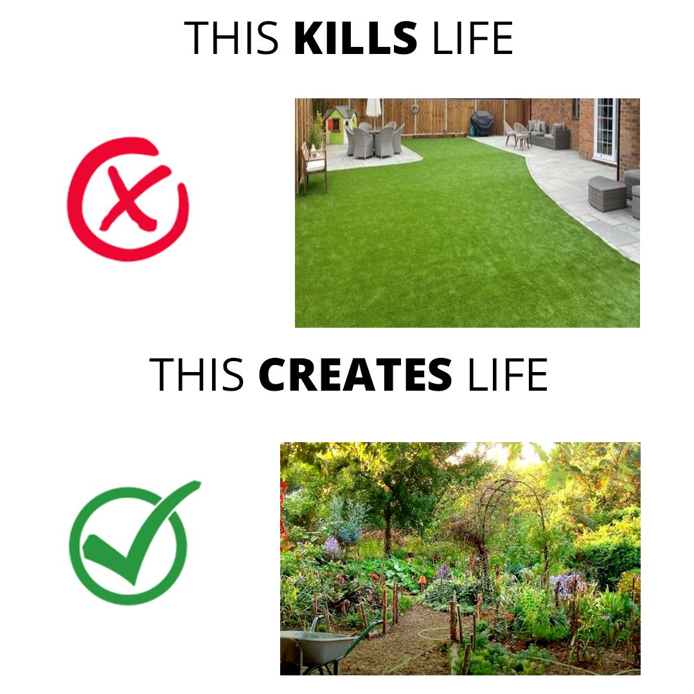

<h2>llama-3.2-vision</h2>

The meme is a humorous comparison between two types of lawns: one made of artificial turf and one made of living plants. The text &quot;THIS KILLS LIFE&quot; appears above a photo of a lawn made of artificial turf, while &quot;THIS CREATES LIFE&quot; appears above a photo of a garden or garden-like setting. The meme is saying that while a lawn made of artificial turf is lifeless and life-destroying, a garden or garden-like setting is full of life and life-creating.

<h2>first-seen</h2>

2023-11-01T02:54:23+00:00

<h2>tesseract</h2>

THIS KILLS LIFE rua jl i BR! I ile THIS CREATES LIFE Sec RENE nr ora Tg sae eo. ae ae ee

