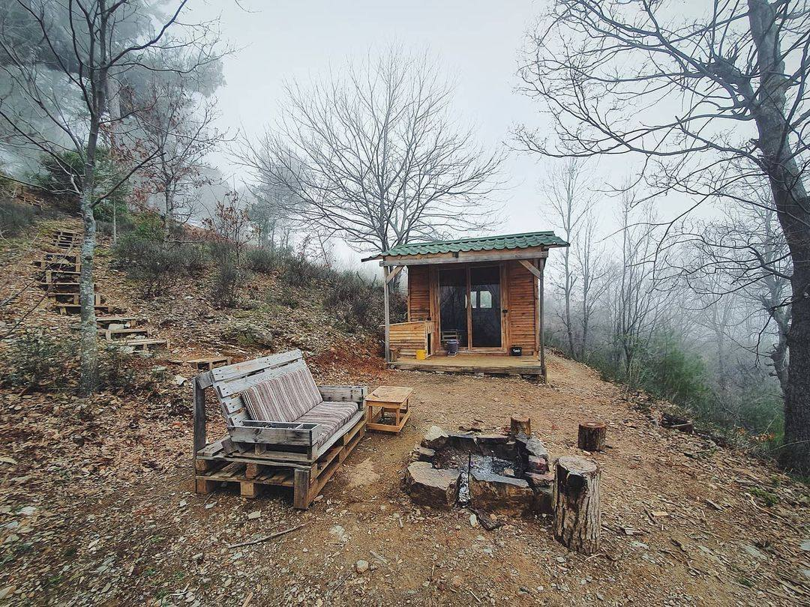

<h2>llama-3.2-vision</h2>

<i>Llama-3.2-Vision-11B is a really good model that probably gets the visual details right but doesn't understand literary or media references, and often fails to accurately represent the physical arrangement of objects and the implied relationships between the objects.</i>

The meme is a picture of a small, rustic cabin in the woods, with a sign on the door that says &quot;No Humans&quot;. The image is likely meant to be humorous or ironic, implying that the cabin is intended for animals or that the owner is trying to escape the world.

<h2>first-seen</h2>

<i>Because Git doesn't preserve file modification times, this metadata file contains the file's modification time when it was added to the library.</i>

2023-11-09T21:59:32+00:00

<h2>tesseract</h2>

<i>Tesseract is often terrible and just gives a lot of nonsense characters, but it used to be the state of the art, and usually it is better at correctly representing text than llama-3.2-vision-11b.</i>

Se RE LAR AY : Vas NOTA f NORA LG 7 2 VE A. SL SRE SH a Wo ae ; ‘ SSH FZ Seah X\ CESS A hese Ae, Se es Oe Ee LSS es ON ee | Ne OK ae L Mes ao” KONG H RH rT ae Y 2 AS UN VA Sy PS / SS a 2 SNH ee ENG = \ Lk) se NW SS Ss aS ee RANE ey WI ae a ee SAS Vee (A i eh ee Se cy = SY S\ WS Vege VS ee au \ ee a le as: Wes 5° = = \| VW oe on SSS i. ee = eee Ss ae, aa a A AA sea ae et 2 Be . 7] y, Ve Nica 4 2 ee a Duduith | WW Se sm Ne i ON Ne Nee, ey ee aS ee i Oe 2g te ee Re ee Se Oe eee — Joes a Re eee NE A al eee ae ee BA Wey ce ae ie = oe 2 Ep Ne ie Ales = a os ee See a 8 ee LY Rie By eS Pe in 42 ee ae Pe 6 eee OR BT gs ee * : = ES yo es. Se I ee Ree gee ee eS PE aE GO A a aoe OO — LG ge =. ee Ss SSS IES Ee I a) eS RNS En i a fe es BEE a i AE oe SUNG SRN SENSES SD ee RS BOR SESS SLE ELIE EA OR BIN SESS

