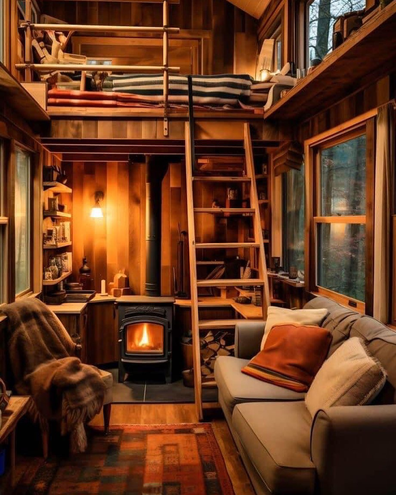

<h2>llama-3.2-vision</h2>

This meme features a cozy cabin interior with a couch, a bookshelf, and a loft bed. The text &quot;I&#x27;m not lazy, I&#x27;m just conserving energy for my next adventure&quot; appears above the couch, implying that the person is not being lazy, but rather preparing for a future activity. The image is meant to be humorous and relatable, poking fun at the idea that people often use &quot;I&#x27;m just conserving energy&quot; as an excuse for laziness.

<h2>first-seen</h2>

2023-11-08T08:15:43+00:00

<h2>tesseract</h2>

TiN | SOS) oe — SA we yj wy &#125; ; ia | wg a S——=-—- Py ce —— a iT ae - A | : al ae eee i ey les, di eal Sel ay AS —bBEp ~— ae ee ee a ea ze . | a — é &gt; i 4, ae &gt; = 4 &quot; = \ » fj / ve \ 2 \

