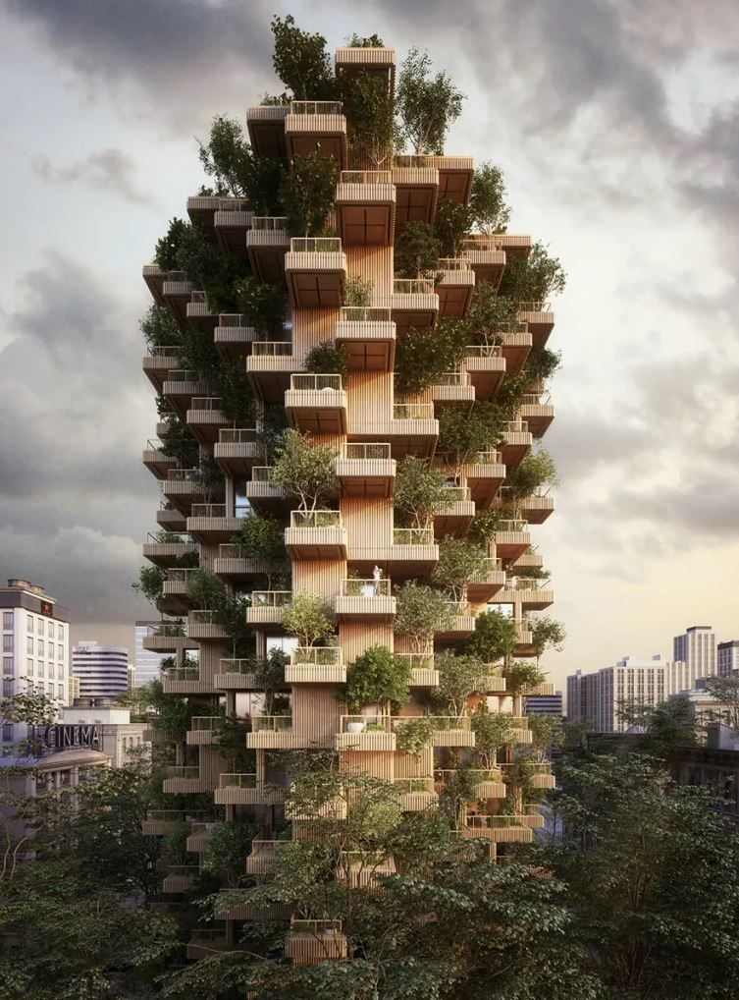

<h2>llama-3.2-vision</h2>

The meme is an image of a futuristic, towering skyscraper made entirely of books, with a massive, glowing &quot;I&quot; in the center of the building. The image is accompanied by the text &quot;I&quot; and the caption &quot;I&quot;. The meme is likely a humorous commentary on the idea that a single, self-identifying &quot;I&quot; can be the entire foundation of a massive, complex structure.

<h2>first-seen</h2>

2023-08-15T00:58:04+00:00

<h2>tesseract</h2>

&gt; a . ” ks fe al P ja a a . pe sn mw F = + a ae ry » Cee, £ x &amp; ell sil oh =e mi ea _ a r gs lla. ‘ a iy a i: ae a ae a gi See tli alii oo a Re lll ae Pus eee ee ead Gas oa | ) an oa “ sg! ae ee ares ‘ee oS ; ; hoe : ae = : EY (ue Se “ee See

