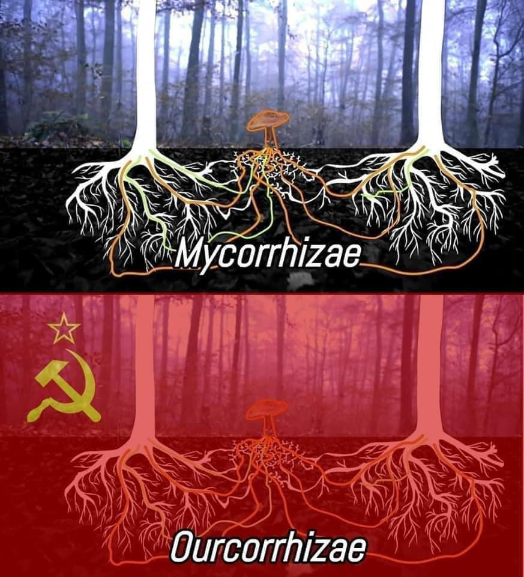

<h2>llama-3.2-vision</h2>

<i>Llama-3.2-Vision-11B is a really good model that probably gets the visual details right but doesn't understand literary or media references, and often fails to accurately represent the physical arrangement of objects and the implied relationships between the objects.</i>

This meme is a play on the differences between two types of fungi: Mycorrhizae and Ourcorhizae. The text &quot;Mycorrhizae&quot; is written above a drawing of a mushroom&#x27;s roots, while &quot;Ourcorhizae&quot; is written above a drawing of a mushroom&#x27;s roots with a hammer and sickle symbol (the symbol of the Soviet Union) incorporated into the roots. The joke is that Mycorrhizae is a type of fungus that forms symbiotic relationships with plants, while Ourcorhizae is a made-up word that sounds similar but is actually a reference to the Soviet Union.

<h2>first-seen</h2>

<i>Because Git doesn't preserve file modification times, this metadata file contains the file's modification time when it was added to the library.</i>

2023-11-13T06:24:08+00:00

<h2>tesseract</h2>

<i>Tesseract is often terrible and just gives a lot of nonsense characters, but it used to be the state of the art, and usually it is better at correctly representing text than llama-3.2-vision-11b.</i>

i =e od ! | | : as pce pul By by | a AD Pte &gt; aig a e ae Pe My CRONIN Ze [2 Ourcorrhizae

