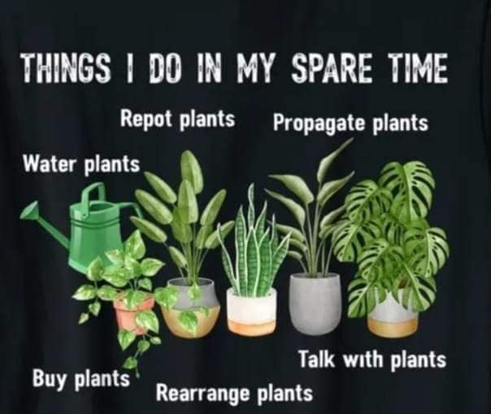

<h2>llama-3.2-vision</h2>

This meme is a humorous list of tasks that are often neglected or procrastinated on, with the title &quot;Things I Do In My Spare Time&quot;. The text reads: &quot;Water plants, Buy plants, Repot plants, Propagate plants, Talk with plants, and Reroute plants&quot;. The image is not described, but the text provides a humorous and relatable list of tasks that are often neglected or procrastinated on.

<h2>first-seen</h2>

2023-11-10T21:41:47+00:00

<h2>tesseract</h2>

SS ae ta a ae cy BS PE WCy Om Chic) : os e ~~, a wf Lat, A) a Ih AM Ag Talk with plants | oma Rearrange plants

