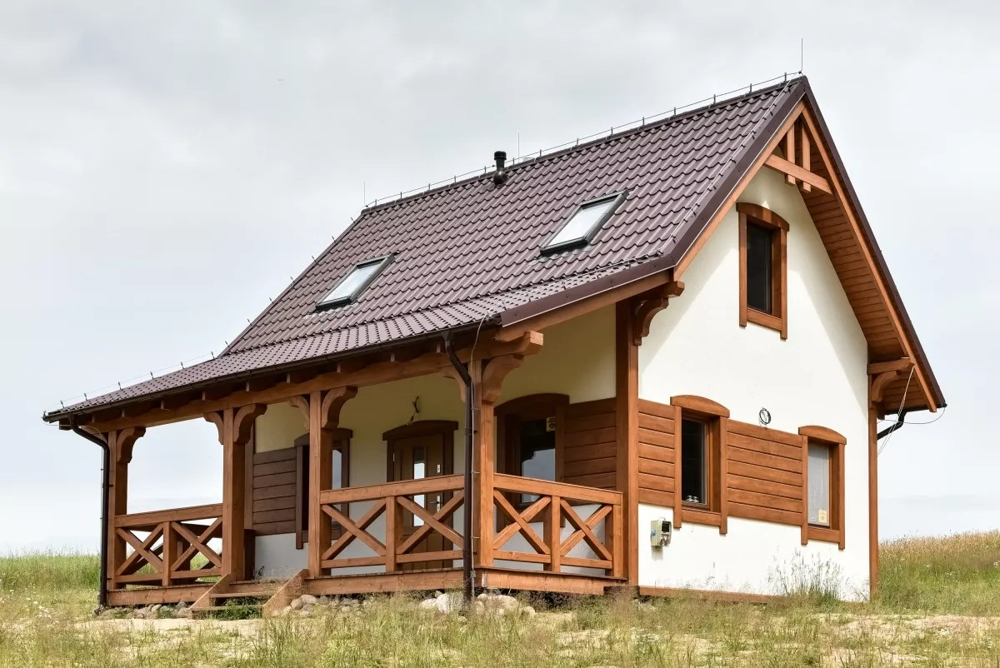

<h2>llama-3.2-vision</h2>

This meme is a simple image of a house with a caption that reads &quot;I can hear you.&quot; The image is likely a play on the idea of a house having a &quot;listening&quot; or &quot;listening&quot; feature, but the actual meaning is a play on the phrase &quot;I can hear you&quot; being a phrase that is often used in a different context.

<h2>first-seen</h2>

2023-11-19T22:16:25+00:00

<h2>tesseract</h2>

Aig _ we) s ee /, 5 SEE EL En 02, LGD, a LO Ze , Ly ie FE: oa : the AEE LE eee JE b ty Me A ey aoe LF 7 al Li FE ca Z | q | | | | 7 yl s | | = — lie. ee SCP KZ —&lt; A iy 9 i as re Te a =f sy a a ee ae hd ‘le: ra = = , - ba ee (Sen We = © oe y = = i ge ak = a =| — | Fate ann es a ied «ali —— | | | aig Le ste , ce 7 ea i hidu dial ie tah Cg Pek ae ae ee ee vidi hb ai is por nasonelh me eso, ee if - ) We | tele cay Ws! one get mi: Sirsa ae ash Rf \ home eS Hib ig RS sae eee ee

