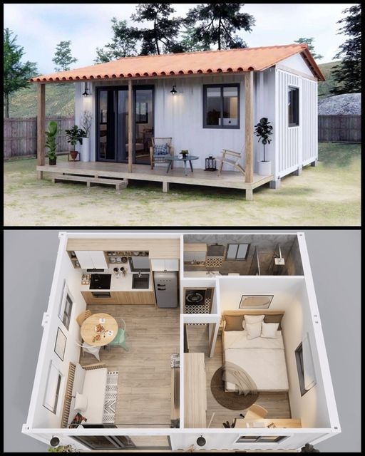

<h2>llama-3.2-vision</h2>

The meme is a split-screen image with a top image of a small, cozy-looking house and a bottom image of a large, luxurious-looking house. The text &quot;I&#x27;ll be living in the top one&quot; is written above the top image, implying that the speaker will be living in a small, simple house, while the others will be living in a large, luxurious one.

<h2>first-seen</h2>

2023-11-17T22:35:07+00:00

<h2>tesseract</h2>

ez eae ot. 2 ee a ne a at _- ; \ ne f a an +. VSS) 6 —

